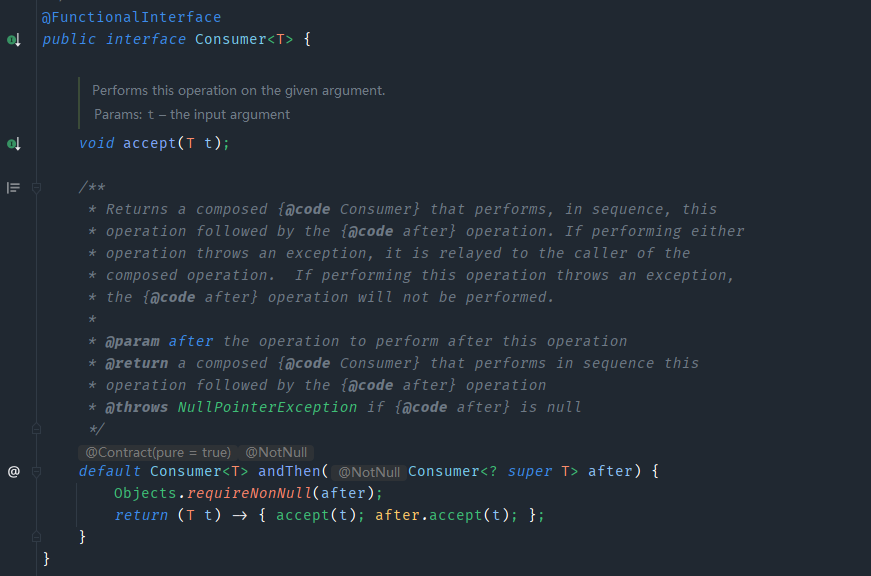

---
# 当前页面内容标题
title: Lambda表达式
# 当前页面图标
icon: strong
# 分类
category:
  - 后端
  - java
# 标签
tag:
  - Lambda表达式
  - 函数式编程
  - stream
  - Optional
sticky: false
# 是否收藏在博客主题的文章列表中，当填入数字时，数字越大，排名越靠前。
star: false
# 是否将该文章添加至文章列表中
article: false
# 是否将该文章添加至时间线中
timeline: false
---


# Lambda表达式(Alt + Enter)


### 1 Lambda表达式

> ​	Lambda是JDK8中的一个语法糖。他可以对某些匿名内部类的写法进行简化。它是函数式编程思想的一个重要体现。让我们关注是什么对象。而是关注我们对数据进行了什么操作。

#### 1. 1 核心原则

**可推导可省略**

#### 1.2 基本格式

```java
(参数列表) -> {代码}
```

#### 1.3 例一

我们在创建线程并启动时可以使用匿名内部类的写法：

```java
new Thread(new Runnable() {
    private void run() {
        sout("this is my baby");
    }
}).start();
```

可以使用Lambda的格式对其进行修改。修改后如下：

```java
new Thread(() -> {
    sout("this is my baby")
});
```

#### 1.4 例二

```java
package cn.thylove.lambda;

import java.util.function.IntBinaryOperator;
public class CalculateDemo {
    public static void main(String[] args) {
        int res = calculateNum(Integer::sum);
        System.out.println(res);
    }
    public static int calculateNum(IntBinaryOperator operator) {
        int a = 10;
        int b = 20;
        return operator.applyAsInt(a, b);
    }

}
```

#### 1.5 例三

```java
package cn.thylove.lambda;

import java.util.function.IntPredicate;
public class PrrintNumber {
    public static void main(String[] args) {
        printNum(value -> value%2 == 0);
    }
    public static void  printNum(IntPredicate predicate) {
        int [] arr = {1, 2, 3, 4, 5, 6, 7, 8, 9, 10};

        for (int i : arr) {
            if (predicate.test(i)) {
                System.out.println(i);
            }
        }
    }

}
```

#### 1.6 例四

```java
public class TypeCoverDemo {
    public static void main(String[] args) {
        Integer integer = typeCover(Integer::parseInt);
        System.out.println(integer);
    }
    public static <R> R typeCover(Function<String, R> function) {
        String str = "1235";
        return function.apply(str);
    }
}
```

### 2. 省略规则

* 参数类型可以省略
* 方法体只有一句话时大括号return和唯一一句话代码的分号可以省略
* 方法只有一个参数时小括号可以省略

### 3. Stream

```java
allAuthor.stream()  // 把List集合对象转成一个stream流对象
    .distinct()
    .filter(authorDTO -> authorDTO.getAuthorAge() > 20)
    .forEach(System.out::println);
```

#### 创建流

**单列集合:** 集合对象

```java
allAuthor.stream();  // 把List集合对象转成一个stream流对象
```


**数组:** `Arrays.stream`(数组)或使用`Stream.of`来创建

```java
Integer[] arr = {1, 2, 3, 4, 5};
Stream<Integer> stream = Arrays.stream(arr);
Stream<Integer> stream2 = Stream.of(arr);
```


**双列集合：**转换成单列集合后再创建

```java
Map<String, Integer> map = new HashMap<>();
map.put("username", "dsq");
map.put("sex", "男");
map.put("age", 18);
Set<Map.Entry<String, String>> entries = map.entrySet();
Optional<Map.Entry<String, String>> first = entries.stream().findFirst();
```

### 4. 中间操作

#### 4.1 筛选操作

##### filter(Predicate predicate)

可以对流中的元素进行条件过滤，符合过滤条件的才能继续留在流中。

```java
.filter(new Predicate<AuthorDTO>() {
    public boolean test(AuthorDTO authorDTO) {
        return authorDTO.getAuthorAge() > 20;
    }
})
.filter(authorDTO -> authorDTO.getAuthorAge() > 20)
```

#### 4.2 映射操作

##### map(Function mapper)

可以把对流中的元素进行`计算`或`转换`。

```java
.map(new Function<AuthorDTO, String>() {
    public String apply(AuthorDTO authorDTO) {
        return authorDTO.getAuthorName();
    }
})
.map(AuthorDTO::getAuthorName)
```

#### 4.3 flatMap

```java
.distinct()
    .flatMap(new Function<AuthorDTO, Stream<Video>>() {
        @Override
        public Stream<Video> apply(AuthorDTO authorDTO) {
            return authorDTO.getVideos().stream();
        }
    })
    .flatMap(video -> video.getVideoTypes().stream())
    .distinct()
    .forEach(System.out::println);
```


#### 4.4 排序操作

##### sored()

可以对流中的元素进行排序。

```java
.sorted(new Comparator<AuthorDTO>() {
    @Override
    public int compare(AuthorDTO o1, AuthorDTO o2) {
        return o1.getAuthorAge() - o2.getAuthorAge();
    }
})
```

**注：**也可以让实体实现`Comparable`接口

#### 4.5 分割操作

##### limit(long maxSize)

可以设置流的最大长度，超出的部分将被抛弃

```java
authorService.getAllAuthor().stream().distinct().filter(authorDTO -> authorDTO.getAuthorAge() > 20).limit(8).forEach(System.out::println);
```

##### skip(long n)

跳过前n个元素

```java
authorService.getAllAuthor().stream().distinct().filter(authorDTO -> authorDTO.getAuthorAge() > 20).skip(8).forEach(System.out::println);
```

#### 4.6 去重操作

##### distinct()

可以去除流中的重复元素。

```java
Student s1 = new Student("dsq", 18, "男");
Student s2 = new Student("dsq", 18, "男");
List<Student> students = new ArrayList<>();
students.add(s1);
students.add(s2);
students.stream().distinct().forEach(System.out::println);
```


**注意：**distinct方法是依赖Object的equals方法来判断是否是相同对象的。所以需要注意重写equals方法

**分片操作**


### 5. 终结操作

#### 5.1 count

可以统计流中元素的个数

```java
long count = authorService.getAllAuthor().stream()
    .distinct()
    .filter(authorDTO -> authorDTO.getAuthorAge() > 20)
    .count();
System.out.println(count);
```


#### 5.2 min&max

可以根据条件找到最大最小的对象

```java
// 根据年龄查询最小年龄的对象
	// 写法一
Optional<AuthorDTO> authorDTOMin = authorService.getAllAuthor().stream()
    .distinct()
    .filter(authorDTO -> authorDTO.getAuthorAge() > 20)
    .min(new Comparator<AuthorDTO>() {
        @Override
        public int compare(AuthorDTO o1, AuthorDTO o2) {
            return o1.getAuthorAge() - o2.getAuthorAge();
        }
    });
authorDTOMin.ifPresent(System.out::println);
	// 写法二
Optional<AuthorDTO> authorDTOMin = authorService.getAllAuthor().stream()
    .distinct()
    .filter(authorDTO -> authorDTO.getAuthorAge() > 20)
    .min((author1, author2) -> author1.getAuthorAge() - author2.getAuthorAge());
authorDTOMin.ifPresent(System.out::println);
	// 写法三
Optional<AuthorDTO> authorDTOMin = authorService.getAllAuthor().stream()
    .distinct()
    .filter(authorDTO -> authorDTO.getAuthorAge() > 20)
    .min(Comparator.comparingInt(AuthorDTO::getAuthorAge));
authorDTOMin.ifPresent(System.out::println);

```


#### 5.3 collect

把当前流转换成一个集合

**List**

```java
// 把author的名字转成List集合
List<String> authorName = authorService.getAllAuthor().stream().distinct().map(AuthorDTO::getAuthorName).collect(Collectors.toList());
System.out.println(authorName);
```

**Set**

```java
// 把author换年龄放到一个Set集合中
Set<Integer> ages = authorService.getAllAuthor().stream().map(AuthorDTO::getAuthorAge).collect(Collectors.toSet());
ages.forEach(System.out::println);
```

**map**

```java
// 把author的名字和视频转成一个map
Map<String, List<String>> userVideo = authorService.getAllAuthor().stream().collect(Collectors.toMap(new Function<AuthorDTO, String>() {
    @Override
    public String apply(AuthorDTO authorDTO) {
        return authorDTO.getAuthorName();
    }
}, new Function<AuthorDTO, List<String>>() {
    @Override
    public List<String> apply(AuthorDTO authorDTO) {
        return authorDTO.getVideos().stream().map(Video::getVideoName).collect(Collectors.toList());
    }
}));
System.out.println(userVideo);

// 改写
Map<String, List<String>> userVideo = authorService.getAllAuthor().stream().
    collect(
    Collectors.toMap(
        AuthorDTO::getAuthorName, 
        authorDTO -> authorDTO.getVideos().stream().
        map(Video::getVideoName).
        distinct().
        collect(Collectors.toList())));
System.out.println(userVideo);
```

##### 分组操作

###### groupingBy(Function classifier)

#### 5.4 查找与匹配

##### anyMatch

可以用来判断是否胡任意符合匹配条件的元素，结果为boolean类型。

```java
boolean lg40 = authorService.getAllAuthor().stream().distinct().anyMatch(authorDTO -> authorDTO.getAuthorAge() > 40);
System.out.println(lg40);
```


##### allMatch

全部都符合

```java
boolean all10 = authorService.getAllAuthor().stream().distinct().allMatch(authorDTO -> authorDTO.getAuthorAge() > 10);
System.out.println(all10);
```


##### noneMatch

全部都不符合

```java
boolean none18 = authorService.getAllAuthor().stream().distinct().noneMatch(authorDTO -> authorDTO.getAuthorAge() > 18);
System.out.println(none18);
```


##### findAny

```java
authorService.getAllAuthor().stream().distinct().findAny().ifPresent(System.out::println);
```


##### findFirst

```java

authorService.getAllAuthor().stream().distinct().filter(authorDTO -> authorDTO.getVideos().size() > 0).findFirst().ifPresent(System.out::println);

authorService.getAllAuthor().stream().distinct().filter(authorDTO -> authorDTO.getVideos().size() > 0).min(Comparator.comparingInt(authorDto -> authorDto.getVideos().size())).ifPresent(System.out::println);

```

#### 5.5 reduce归并

对流中的数据按照你制定的计算方式算出一个结果。

reduce的作用是把stream中的元素组合起来，我们可以传入一个初始值 ，它会按照我们的计算方式依次拿流中的元素和在初始值的基础上进行计算，计算结果再和后面的元素计算。

**内部的计算方式**

```java
T result = identity;
for (T element : this stream) 
    result = accumulator.apply(result, element)
return result;

```

其中identity就是我们可以通过方法参数传入的初始值, accumlator的apply具体进行什么计算也是我们通过方法参数来确定的。

```java
BinaryOperator类
System.out.println(authorService.getAllAuthor().stream().map(AuthorDTO::getAuthorAge).reduce(0, Integer::sum));
```

```java
boolean foundAny = false;  
T result = null;  
for (T element : this stream) {      
    if (!foundAny) {          
        foundAny = true;          
        result = element;      
    }
    else
    	result = accumulator.apply(result, element);  
}  
return foundAny ? Optional.of(result) : Optional.empty();
```

### 6. 注意事项

* 惰性求值(如果没有终结操作，没有中间操作是不会得到执行的)
* 流是一次性的(一旦流对象经过一个终结操作后，这个流就不能再被使用)
* 不会影响原数据(我们在流中可以多数据做很多处理。但是正常情况下是不会影响原来集合中的元素的。这往往也是我们期望的)

### 7. Optional

> ​	我们在编写代码的时候出现最多的就是空指针异常。所以在很多情况下我们需要做各种非空的判断。

```java
Author author = getAuthor;
if(author != null) {
    System.out.println(author.getName());
}
```

尤其是对象中的属性还是一个对象的情况下。这种判断会更多。而过多抱着判断语句会让我们的代码显得臃肿不堪。所以在JDK8中引入了Optional，养成使用Optional的习惯后你可以写出更优雅的代码来避免空指针异常。并且在很多函数式编程相关的API中也都用到了Optional，如果不会使用Optional也会对函数式编程的学习造成影响。

#### 7.1 创建对象

Optional就好像是包装类，可以把我们的具有数据封装Optional对象内部。然后去使用Optional中封装好的方法操作封装进去的数据就可以非常优雅的避免空指针异常。

我们一般使用**Optional**的**静态方法ofNullable**来把数据封装成一个Optional对象。无论传入的参数是否为null都不会出现问题。

```java
Optional.ofNullable(authorService.getAuthorById("cc7391a56c474acd8c14fa98f0833fff")).ifPresent(System.out::println);
```

在实际开发中我们的数据很多是从数据库中获取的。Mybatis从3.版本可以支持Optional了。我们可以直接把dao方法的返回值类型定义成Optional类型，Mybatis会自己把数据封装成Optional对象返回。封装的过程也不需要我们自己操作


如果你**确定一个对象不是空**的则可以使用**Optional的静态方法of**来把数据封装成Optional对象。

```java
Optional.of(authorService.getAuthorById("cc7391a56c474acd8c14fa98f0833fff")).ifPresent(authorDTO -> System.out.println(authorDTO.getAuthorName()));
```


如果一个方法的返回值类型是Optional类型。而如果我们经判断发现某次计算得到的**返回值为null**，这个时候就需要把null封装成Optional对象返回。这时则可以使用**Optional的静态方法empty**来进行封装。

```java
Optional.empty();
```

#### 7.2 获取值

```jva
// orElse
AuthorDTO authorDTO = Optional.ofNullable(authorService.getAuthorById("cc7391a56c474acd8c14fa98f0833fff")).orElse(new AuthorDTO());
// orElseGet
AuthorDTO authorDTO = Optional.ofNullable(authorService.getAuthorById("cc7391a56c474acd8c14fa98f0833fff")).orElseGet(AuthorDTO::new);
orElseThrow
AuthorDTO authorDTO = Optional.ofNullable(authorService.getAuthorById("cc7391a56c474acd8c14fa98f0833fff")).orElseThrow((Supplier<Throwable>) () -> new RuntimeException("数据为null"));
System.out.println(authorDTO);

```

#### 7.3 过滤

可以根据条件过滤出想要的数据。

```java
Optional<AuthorDTO> authorDTOOptional = Optional.ofNullable(authorService.getAuthorById("cc7391a56c474acd8c14fa98f0833fff"));
authorDTOOptional.filter(authorDTO -> authorDTO.getAuthorAge() >= 20).ifPresent(System.out::println);
```

#### 7.4 判断

可以使用isPresent方法进行是否存在数据的判断。如果为空返回值为false，如果不为空，返回值为true。但是这种方式不能体现Optional的好处。**更推荐使用ifPresent方法**

```java
if (authorDTOOptional.isPresent()) System.out.println(authorDTOOptional.get().getAuthorName());
```

#### 7.5 数据转换

Optional还提供了map可以让我们的对数据进行转换。并且转换得到的数据也还是被Optional包装好的，保证了我们的使用安全。

```java
Optional<AuthorDTO> authorDTOOptional = Optional.ofNullable(authorService.getAuthorById("cc7391a56c474acd8c14fa98f0833fff"));
Optional<List<Video>> videos = authorDTOOptional.map(AuthorDTO::getVideos);
Optional.of(videos.orElseGet(LinkedList::new).stream().peek(System.out::println).count()).ifPresent(System.out::println);
```

### 8. 函数式接口

> ​	**只有一个抽象方法**的接口我们称之为函数接口。
>
> JDK的函数式接口都加上了@FunctionalInterface注解进行标识。但是无论是否加上该注解只要接口中只有一个抽象方法，都是函数式接口。

常见的函数式接口

* Consumer消费接口

​	根据其中抽象方法的参数列表和返回值类型知道，我们可以在方法中对传入的参数进行消费。




### 9. 方法引用

我们在使用lambda时，如果方法体中只有一个方法的调用的话(包括构造方法)，我们可以使用方法引用进一步简化代码。

**基本格式：**类名或者对象名::方法名


<h2>语法</h2>

#### 9.1 **引用静态方法**

其实就是引用类的静态方法

**格式：** 类名::方法名

**使用前提**

如果我们在重写方法的时候，方法体只有**一行代码**，并且这行代码是调用了某个**类的静态方法**，并且我们要把重写的**抽象方法所有的参数都按照顺序传入这个静态方法中**，这个时候就可以引用类的静态方法。

#### 9.2 **引用对象的实例方法**

**格式：** 对象名::方法名

**使用前提**

如果我们在重写方法的时候，**方法体只有一行代码**，并且这行代码是调用了某个**对象的成员方法**，并且我们要把重写的**抽象方法中所有的参数都按照顺序传入这个成员方法中**，这个时候就可以引用类的对象方法。

#### 9.3 **引用类的实例方法**

**格式：** 类名::方法名

**使用前提**

如果我们在重写方法的时候，**方法体只有一行代码**，并且这行代码是调用了第一个**参数的成员方法**，并且我们要把重写的**抽象方法中剩余的所有的参数都按照顺序传入这个成员方法中**，这个时候就可以引用类的实例方法。

#### 9.4 构造器引用

···

### 10 高级用法

#### 10.1 基本数据类型优化

我们之前用到的很多Stream的方法由于都使用了泛型。所以涉及到的参数和返回值都是引用数据类型。

即使我们操作的是整数小数，但是实际用的都是他们的包装类。JDK5中引入的自动装箱和自动拆箱让我们在使用对应的包装类时就好像使用基本数据类型一样方便。但是你一定要知道装箱和拆箱肯定是要消耗时间的。虽然这个时间消耗很下。但是在大量的数据不断的重复装箱拆箱的时候，你就不能无视这个时间损耗了。

所以为了让我们能够对这部分的时间消耗进行优化。Stream还提供了很多专门针对基本数据类型的方法。

例如: **`mapTolnt`,`mapToLong`,`mapToDouble`,`flatMapToInt`,`flatMapToDouble`**等。

#### 10.2 并行流

当流中有大量元素是，我们可以使用并行流去提高操作的效率。其实并行流就是把任务分配给多个线程去完全。如果我们自己去用代码实现的话其实会非常的复杂，并且要求你对并发编程有足够的理解和认识。而如果我们使用Stream的话，我们只需要修改一个方法的调用就可以使用并行流来帮我们实现，从而提高效率。

```java
Optional.of(authorService.getAllAuthor().stream()
            .parallel() // 并行计算
            .peek(new Consumer<AuthorDTO>() {
                @Override
                public void accept(AuthorDTO authorDTO) {
                    System.out.println(authorDTO.getAuthorName() + "::::" + Thread.currentThread().getName());
                }
            })   // 用来调式用的，是个中间操作
            .map(AuthorDTO::getAuthorAge)
            .reduce(0, Integer::sum)
           )
    .ifPresent(System.out::println);
```

****

**parallel**可以把串行流改为并行流。

也可以直接用`.parallelSteam()`代替`.stream() .parallel()`
