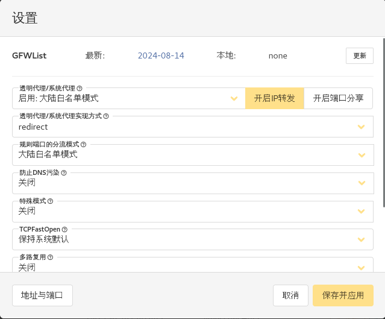
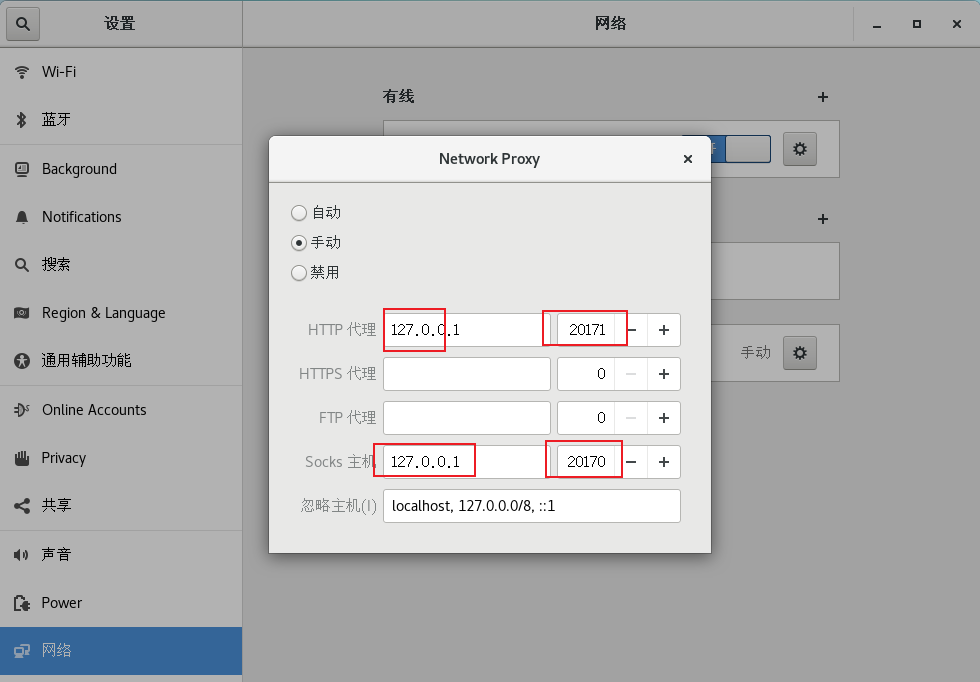

---
# 当前页面内容标题
title: Linux操作
# 当前页面图标
icon: strong
# 分类
category:
  - 后端
  - linux
  - centos7
  - install
# 标签
tag:
  - linux的基础命令
  - linux安装软件
  - vsfptd的配置
  - 靶场的搭建
sticky: false
# 是否收藏在博客主题的文章列表中，当填入数字时，数字越大，排名越靠前。
star: false
# 是否将该文章添加至文章列表中
article: false
# 是否将该文章添加至时间线中
timeline: false
---


# linux

## 一、安装

省略……

## 二、Linux命令

### 1. scp


 ```bash
 scp jdk-8u361-linux-x64.tar.gz root@thylove.cn:/file
 
 ```

### 2. Vi/Vim

```bash
# 多行注释
ctrl + v  # 进入块模式

# 取消多行注释
ctrl + v   选中多选， 再输入x
```


### 3. lsof

**查看端口占用**

```bash
[root@localhost package]# lsof -i tcp:9090
COMMAND     PID USER   FD   TYPE DEVICE SIZE/OFF NODE NAME
prometheu 16628 root    7u  IPv6  59525      0t0  TCP *:websm (LISTEN)
prometheu 16628 root   11u  IPv6  51271      0t0  TCP localhost:60634->localhost:websm (ESTABLISHED)
prometheu 16628 root   12u  IPv6  51272      0t0  TCP localhost:websm->localhost:60634 (ESTABLISHED)
prometheu 16628 root   13u  IPv6  60093      0t0  TCP localhost.localdomain:websm->192.168.1.11:uohost (ESTABLISHED)
prometheu 16628 root   14u  IPv6  58533      0t0  TCP localhost.localdomain:websm->192.168.1.11:cdid (ESTABLISHED)
prometheu 16628 root   15u  IPv6  29587      0t0  TCP localhost.localdomain:websm->192.168.1.11:aicc-cmi (ESTABLISHED)
```

### 4. netstat

```bash
[root@localhost package]# netstat -nplt |  grep 9090
tcp6       0      0 :::9090                 :::*                    LISTEN      16628/prometheus
```

### 5. ens33

**配置静态ip地址**

```bash
[root@localhost ~]# vim /etc/sysconfig/network-scripts/ifcfg-ens33
```

```bash
# ifcfg-ens33
TYPE="Ethernet"
PROXY_METHOD="none"
BROWSER_ONLY="no"
BOOTPROTO="static"
DEFROUTE="yes"
IPV4_FAILURE_FATAL="no"
IPV6INIT="yes"
IPV6_AUTOCONF="yes"
IPV6_DEFROUTE="yes"
IPV6_FAILURE_FATAL="no"
IPV6_ADDR_GEN_MODE="stable-privacy"
NAME="ens33"
UUID="99548f46-f8c0-4e7a-bbf6-5917b2befcd4"
DEVICE="ens33"
ONBOOT="yes"
IPADDR=192.168.1.15
NETMASK=255.255.255.0
GATEWAY=192.168.1.1
DNS1=8.8.8.8
DNS2=10.255.255.25
```

**重启网络服务**

```bash
[root@localhost ~]# service network restart
```


## 三、Linux安装软件

### 1 安装完成初始化

```bash
#1 关闭SELinux  修改 etc/selinux/config 文件 将SELINUX=enforcing改为SELINUX=disabled 然后重启服务器 reboot 即可

#2 关闭防火墙 systmctl stop firewalld
# 开放指定端口（8080端口）：firewall-cmd --zone=public --add-port 8080/tcp --permanent (--permanent 表示永久生效，没有此参数重启后失效)
#重新加载firewall：修改配置后，必须重新加载才能生效：firewall-cmd --reload
#停用指定端口（8080端口）：firewall-cmd --zone=public --remove-port 8080/tcp --permanent
#配置完之后记得重新加载firewall
#firewall-cmd对端口的操作，如开放端口等信息，都放在/etc/firewall/zones/public.xml中记录

#3 CentOS 7 配置yum阿里源
cd /etc/yum.repos.d/
ls
rm -rf ./*
# 配置阿里源
wget -O /etc/yum.repos.d/CentOS-Base.repo https://mirrors.aliyun.com/repo/Centos7.repo
# 配置扩展包
wget -O /etc/yum.repos.d/epel.repo https://mirrors.aliyun.com/repo/epel-7.repo

yum list

yum update

yum upgrade
```

### 2 安装 v2raya

先安装v2ray-core，从此处下载：https://github.com/v2fly/v2ray-core/releases

解压

```bash
sudo unzip v2ray-linux-64.zip -d /usr/local/v2ray-core
```

然后拷贝geoip.dat和geosite.dat到/usr/local/share/v2ray/：

```bash
sudo mkdir -p /usr/local/share/v2ray/
sudo mv /usr/local/v2ray-core/*dat /usr/local/share/v2ray/
```

v2rayA安装，从此处下载：https://github.com/v2rayA/v2rayA/releases/

下载对应架构的包后安装：

```bash
# cenots
rpm -ivh installer_redhat_x64_2.2.5.8.rpm
# ubuntu
sudo dpkg -i installer_debian_x64_2.2.5.8.deb
```

配置v2rayA：

```bash
vim /etc/default/v2raya
# 在文件的最后添加
V2RAYA_V2RAY_BIN=/usr/local/v2ray-core/v2ray
V2RAYA_V2RAY_CONFDIR=/usr/local/v2ray-core
```

设置开机自启：

```bash
sudo systemctl enable --now v2raya
sudo systemctl status v2raya
```

浏览器访问：

http://127.0.0.1:2017

导入订阅，修改配置



注：设置手动代理



### 3 kali靶场的搭建

https://github.com/vulhub

### 4 vsftpd配置

```bash
# Example config file /etc/vsftpd/vsftpd.conf
#
# Allow anonymous FTP? (Beware - allowed by default if you comment this out).
anonymous_enable=YES
#
# Uncomment this to allow the anonymous FTP user to upload files. This only
# has an effect if the above global write enable is activated. Also, you will
# obviously need to create a directory writable by the FTP user.
# When SELinux is enforcing check for SE bool allow_ftpd_anon_write, allow_ftpd_full_access
# 给/var/ftp/pub/ 写权限，才可以上传，只能上传。 chmod o+w /var/ftp/pub/ 
anon_upload_enable=YES
#
# Uncomment this to allow local users to log in.
# Uncomment this if you want the anonymous FTP user to be able to create
# new directories.
# 可以创建目录，但不可以重命名
anon_mkdir_write_enable=YES
#
# 可以对文件或目录，进行重命名、删除权限
anon_other_write_enable=YES
#
# 匿名用户登录的目录 (默认为/var/ftp)
#anon_root=/var/ftp/pub/
# If you want, you can arrange for uploaded anonymous files to be owned by
# a different user. Note! Using "root" for uploaded files is not
# recommended!
# 设置是否改变匿名用户上传文件（非目录）的属主
chown_uploads=YES
# 设置匿名用户上传文件的属主名，建议不要设置成root
chown_username=ftpthylove
#


# When SELinux is enforcing check for SE bool ftp_home_dir
local_enable=YES
#
# 本地用户登录之后的目录
#local_root=/ftpuser/ftpthylove
local_root=/var/ftp/
#
# Uncomment this to enable any form of FTP write command.
write_enable=YES
#
# Default umask for local users is 077. You may wish to change this to 022,
# if your users expect that (022 is used by most other ftpd's)
local_umask=022
#
# You may specify an explicit list of local users to chroot() to their home
# directory. If chroot_local_user is YES, then this list becomes a list of
# users to NOT chroot().
# (Warning! chroot'ing can be very dangerous. If using chroot, make sure that
# the user does not have write access to the top level directory within the
# chroot)
# A = chroot_list_enable, B = chroot_local_user
# ① 当A=YES,B=YES时，在 /etc/vsftpd/chroot_list 文件中的用户可以切换到其他目录，未在文件中列出的用户，不能切换到其他目录。
# ② 当A=YES,B=NO时，在 /etc/vsftpd/chroot_list 文件中的用户不可以切换到其他目录，未在文件中列出的用户，可以切换到其他目录。
# ③ 当A=NO,B=YES时，所有用户均不能切换到其他目录
# ④ 当A=NO,B=NO时，所有用户均可以切换到其他目录
allow_writeable_chroot=YES
chroot_local_user=YES
chroot_list_enable=YES
# (default follows)
chroot_list_file=/etc/vsftpd/chroot_list
#
# Activate directory messages - messages given to remote users when they
# go into a certain directory.
dirmessage_enable=YES
#
# Activate logging of uploads/downloads.
xferlog_enable=YES
#
# Make sure PORT transfer connections originate from port 20 (ftp-data).
connect_from_port_20=YES
#
# You may override where the log file goes if you like. The default is shown
# below.
#xferlog_file=/var/log/xferlog
#
# If you want, you can have your log file in standard ftpd xferlog format.
# Note that the default log file location is /var/log/xferlog in this case.
xferlog_std_format=YES
#
# You may change the default value for timing out an idle session.
#idle_session_timeout=600
#
# You may change the default value for timing out a data connection.
#data_connection_timeout=120
#
# It is recommended that you define on your system a unique user which the
# ftp server can use as a totally isolated and unprivileged user.
#nopriv_user=ftpsecure
#
# Enable this and the server will recognise asynchronous ABOR requests. Not
# recommended for security (the code is non-trivial). Not enabling it,
# however, may confuse older FTP clients.
#async_abor_enable=YES
#
# By default the server will pretend to allow ASCII mode but in fact ignore
# the request. Turn on the below options to have the server actually do ASCII
# mangling on files when in ASCII mode. The vsftpd.conf(5) man page explains
# the behaviour when these options are disabled.
# Beware that on some FTP servers, ASCII support allows a denial of service
# attack (DoS) via the command "SIZE /big/file" in ASCII mode. vsftpd
# predicted this attack and has always been safe, reporting the size of the
# raw file.
# ASCII mangling is a horrible feature of the protocol.
#ascii_upload_enable=YES
#ascii_download_enable=YES
#
# You may fully customise the login banner string:
#ftpd_banner=Welcome to blah FTP service.
#
# You may specify a file of disallowed anonymous e-mail addresses. Apparently
# useful for combatting certain DoS attacks.
#deny_email_enable=YES
# (default follows)
#banned_email_file=/etc/vsftpd/banned_emails
#
# You may activate the "-R" option to the builtin ls. This is disabled by
# default to avoid remote users being able to cause excessive I/O on large
# sites. However, some broken FTP clients such as "ncftp" and "mirror" assume
# the presence of the "-R" option, so there is a strong case for enabling it.
#ls_recurse_enable=YES
#
# When "listen" directive is enabled, vsftpd runs in standalone mode and
# listens on IPv4 sockets. This directive cannot be used in conjunction
# with the listen_ipv6 directive.
listen=NO
#
# This directive enables listening on IPv6 sockets. By default, listening
# on the IPv6 "any" address (::) will accept connections from both IPv6
# and IPv4 clients. It is not necessary to listen on *both* IPv4 and IPv6
# sockets. If you want that (perhaps because you want to listen on specific
# addresses) then you must run two copies of vsftpd with two configuration
# files.
# Make sure, that one of the listen options is commented !!
listen_ipv6=YES

pam_service_name=vsftpd
userlist_enable=YES
tcp_wrappers=YES
```

**示例**

```bash
# 允许匿名登录
anonymous_enable=YES
# 匿名登录的目录
anon_root=/ftpuser/ftpthylove/pub
# 允许本地用户登录
local_enable=YES

write_enable=YES
local_umask=022
# 本地用户登录的目录
local_root=/ftpuser/ftpthylove
# A = chroot_list_enable, B = chroot_local_user
# ① 当A=YES,B=YES时，在 /etc/vsftpd/chroot_list 文件中的用户可以切换到其他目录，未在文件中列出的用户，不能切换到其他目录。
# ② 当A=YES,B=NO时，在 /etc/vsftpd/chroot_list 文件中的用户不可以切换到其他目录，未在文件中列出的用户，可以切换到其他目录。
# ③ 当A=NO,B=YES时，所有用户均不能切换到其他目录
# ④ 当A=NO,B=NO时，所有用户均可以切换到其他目录
allow_writeable_chroot=YES
chroot_local_user=YES
chroot_list_enable=YES
chroot_list_file=/etc/vsftpd/chroot_list

dirmessage_enable=YES
xferlog_enable=YES
connect_from_port_20=YES
xferlog_std_format=YES
listen=NO
listen_ipv6=YES
pam_service_name=vsftpd
userlist_enable=YES
tcp_wrappers=YES

```

