---
# 当前页面内容标题
title: Redis
# 当前页面图标
icon: redis
# 分类
category:
  - 后端
  - java
  - redis
# 标签
tag:
  - redis
sticky: false
# 是否收藏在博客主题的文章列表中，当填入数字时，数字越大，排名越靠前。
star: false
# 是否将该文章添加至文章列表中
article: false
# 是否将该文章添加至时间线中
timeline: false
---


# redis基础篇

## 1、redis入门

### 1.1  redis的特性


> Redis诞生于2009年全称是Remote Dictionary Server, 远程词典服务器，是一个基于内存的键值型Nosql数据库。

**特征**
键值（key-value) 型，value支持多种不同数据结构，功能丰富

* 单线程，每个命令具备原子性
* 低延迟，速度快(基于内存、IO多路复用、良好的编码)。
* 支持数据库的持久化
* 支持主从集群、分片集群
* 支持多语言客户端

### 1.2 redis安装与启动

#### 1.2.1 **redis安装**

1. 先安装gcc

```bash
yum install -y gcc tcl
```

2. 将redis-6.2.6.tar 上传到/usr/local/src里

3. 解压 并进入redis-6.2.6


4. 运行编译命令：
   ```bash
   make && make install
   ```

   注：**如果没有出错，基本上就是安装成功了。**


   默认的安装路径是`/usr/local/bin`目录下：

#### 1.2.2 **指定配置文件启动**

1. 修改配置文件


首先备份配置文件

```bash
cp redis.conf redis.conf.bk
```


然后修改redis.config文件中的一些配置：

```bash
# 允许访问的地址，默认是127.0.0.1，会导致只能在本地访问，修改为 0.0.0.0 则可以在任意的IP访问，生产环境下不要设置为0.0.0.0
bind 0.0.0.0

# 守护进程，修改为yes后即可后天运行
daemonize yes

# 密码，设置后访问redis必须输入密码
requeirepass 123321
```

Redis其他的一些配置：

```bash
# 监听的端口
port 6379

# 工作目录，默认是当前目录，也就是运行redis-server时的命令，日志、持久化等文件会保存在这个目录
dir .

# 数据库数量，设置为1，代表制使用1个数据库，默认有16个库，编号0-15
databases 1

# 设置redis能够使用的最大内存
maxmemory 512mb

# 日志文件、默认为空，不记录日志，可以指定日志文件名
logfile "redis.log"
```

启动**redis**

```bash
# 进入redis的安装目录
cd /usr/loval/src/redis-6.2.6
# 启动
redis-server redis.conf
```

#### 1.2.3 设置开机启动

通过配置的方式设置开机启动

首先，新建一个系统服务文件：

```sh
vim /etc/systemd/system/redis.service
```

文件内容如下：

```sh
[Unit]
Description=redis-server
After=network.target

[Service]
Type=forking
ExecStart=/usr/local/bin/redis-server /usr/local/src/redis-6.2.6/redis.conf
privateTmp=true

[Install]
WantedBy=multi-user.target
```

然后重载系统服务

```sh
systemctl daemon-reload
```

```sh
# 启动服务
systemctl start redis
# 查看状态
systemctl status redis
# 设置开机启动
systemctl enable redis
```

##   2、redis命令

### 2.1 Redis通用命令

通用指令是部分数据类型的，谁都可以使用的指令，常见的有：

* keys: 查看符合模板的所有key, **不建议在生产环境上使用**

  ```bash
  127.0.0.1:6379> help keys

    KEYS pattern
    summary: Find all keys matching the given pattern
    since: 1.0.0
    group: generic
  ```

* del: 根据key删除

  ```bash
  127.0.0.1:6379> help del

    DEL key [key ...]
    summary: Delete a key
    since: 1.0.0
    group: generic
  ```

* EXISTS: 判断key是否存在

  ```bash
  127.0.0.1:6379> help exists

    EXISTS key [key ...]
    summary: Determine if a key exists
    since: 1.0.0
    group: generic
  ```

*  EXPIRE: 给一个key设置有效期，有效期到期时该key会被自动删除

  ```bash
  127.0.0.1:6379> help EXPIRE

    EXPIRE key seconds
    summary: Set a key's time to live in seconds
    since: 1.0.0
    group: generic
  ```

* TTL: 查看一个key剩余的有效期

  ```bash
  127.0.0.1:6379> help TTL

    TTL key
    summary: Get the time to live for a key
    since: 1.0.0
    group: generic2.2
  ```

### 2.2 String类型命令

> ​	String 类型，也就是字符串类型，是Redis中最简单的存储类型。
>
> 其Value是字符串，不过根据字符串的格式不同又可以分为3类：
>
> * String: 普通字符串
> * int: 整数类型，可以做自增、自减操作
> * float: 浮点类型，可以做自增、自减操作

不管是那种格式，底层都是字节数组形式存储，只不过是编码方式不同。字符串类型最大存储空间不能超过512M.

| **KEY** |    VALUE    |
| :-----: | :---------: |
|   msg   | hello world |
|   num   |     10      |
|  score  |    92.5     |

String类型常见命令：

* SET: 添加或者修改已存在的一个String类型的键值对

* GET: 根据key获取String类型的value

* MSET: 批量添加多个String类型的键值对

* MGET: 根据多个key获取多个String类型的value

* INCR: 让一个整型的key自增1

* INCRBY: 让一个整型的key自增并指定步长，例如incrby num 2 让num 值自增2

* INCRBYFLOATL: 让一个浮点类型的数字自增并指定步长

* SETNX: 添加一个String类型的键值对，前提是这个key不存在，否则不执行

  ```bash
  127.0.0.1:6379> help setnx

    SETNX key value
    summary: Set the value of a key, only if the key does not exist
    since: 1.0.0
    group: string
  ```

* SETEX: 添加一个String类型的键值对，并指定有效期  `ex --> expire`

### 2.3 key的层级结构

Redis的key允许有多个单词形成层级结构，多个单词之间 ':' 隔开，格式如下：

​																							`'项目名:业务名:类型:id'`

例子：

例如我们的项目名称叫做heima, 有user和product两种不同的数据类型，我们可以这样定义key:

```bash
# user相关的key:
heima:user:1
# product相关的key
heima:product:1
```

如果Value是一个java对象，例如一个User对象，则可以将对象序列化为JSON字符串后存储：


### 2.4 hash类型命令

> ​	Hash类型，也叫散列，其value是一个无序字典，类似于Java中的HashMap结构

Hash结构可以将对象中的每个字段独立存储，可以针对每个字段做CRUD:

| key          | value           |       |
| ------------ | --------------- | ----- |
|              | field(hash key) | value |
| heima:user:1 | name            | Jack  |
|              | age             | 21    |
| heima:user:2 | name            | Rose  |
|              | age             | 18    |

Hash的常见命令有：

* HSET key field value: 添加或者修改hash类型key的field的值
* HGET key field: 获取一个hash类型key的field的值
* HMSET: 批量添加多个hash类型key的field的值
* HMGET: 批量获取多个hash类型key的field的值
* HGETALL: 获取一个hash类型的key中的所有的filed和value
* HKEYS: 获取一个hash类型的key中的所有的field
* HVALS: 获取一个hash类型的key中方的所有的value
* HINCRBY: 让一个hash类型key的字段值自增并指定步长
* HSETNX: 添加一个hash类型的key的field值，前提是这个fiekd不存在，否则不执行

```bash
127.0.0.1:6379> HSET thylove:user:1 name dsq
(integer) 1
127.0.0.1:6379> HSET thylove:user:1 age 18
(integer) 1
127.0.0.1:6379> hset thylove:user:2 name ym age 28 sex man
(integer) 3
127.0.0.1:6379> hget thylove:user:2 name
"ym"
127.0.0.1:6379> hgetall thylove:user:2
1) "name"
2) "ym"
3) "age"
4) "28"
5) "sex"
6) "man"
127.0.0.1:6379> hkeys thylove:user:2
1) "name"
2) "age"
3) "sex"
127.0.0.1:6379> hvals thylove:user:2
1) "ym"
2) "28"
3) "man"
127.0.0.1:6379> HINCRBY thylove:user:2 age 2
(integer) 30
127.0.0.1:6379> HSETNX thylove:user:2 hobby yinu
(integer) 1
```

### 2.5 List类型命令

> ​	Redis中的List类型于java中的LinkList类似，

List的常见命令有：

* LPUSH key element...: 向列表左侧插入一个或多个元素
* LPOP key: 移除并返回列表左侧的第一个元素，没有则返回nil
* RPUSH key element ... : 向列表右侧插入一个或多个元素
* RPOP key: 移除并返回列表右侧的第一个元素
* LRANGE key star end : 返回一段角标范围内的所有元素
* BLPOP和eBRPOP: 与LPOP和RPOP类似，只不过在没有元素时等待指定时间，而不是直接返回nil


```bash
127.0.0.1:6379> LPUSH users c b a
(integer) 3
127.0.0.1:6379> LRANGE users 0 2
1) "a"
2) "b"
3) "c"
127.0.0.1:6379> RPUSH users d e f
(integer) 6
127.0.0.1:6379> LRANGE users 0 5
1) "a"
2) "b"
3) "c"
4) "d"
5) "e"
6) "f"
127.0.0.1:6379> LPOP users 1
1) "a"
127.0.0.1:6379> LRANGE users 0 4
1) "b"
2) "c"
3) "d"
4) "e"
5) "f"
127.0.0.1:6379> RPOP users 1
1) "f"
127.0.0.1:6379> LRANGE users 0 3
1) "b"
2) "c"
3) "d"
4) "e"
127.0.0.1:6379> BLPOP user2 100
1) "user2"
2) "c"
(69.26s)
```

思考：

1. 如何利用List系欸过模拟一个栈？

   入口和出口在同一边

2. 如何利用List结构模拟一个队列？

   入口和出口在不同边

3. 人如何利用List结构模拟一个阻塞队列？

   入口和出口在不同边

   出队时采用BLPOP或BRPOP

### 2.6 Set类型命令


* SADD key member ...: 向set中添加一个或多个元素
* SREM key member ...: 移除set中的指定元素
* SCARD key: 返回set中元素的个数
* SISMEMBER key member: 判断一个元素是否存在于set中
* SMEMBERS: 获取set中的所有元素
* SINTER key1 key2 ... : 求key1 与key2的交集
* SDIFF key1 key2 ...: 求key1与key2的差集
* SUNION key1 key2 ...: 求key1和key2的并集


将下列数据用Redis的set集合来存储：

* 张三的好友有：李四、王五、赵六

* 李四的好友有： 王五、麻子、二狗

  ```bash
  127.0.0.1:6379> SADD zs lisi wangwu zhaoliu
  127.0.0.1:6379> SADD lisi wangwu mazi ergou
  ```


利用Set的命令实现下列功能：

* 计算张三的好友有几个人

  ```bash
  127.0.0.1:6379> SCARD zs
  (integer) 3
  ```

* 计算张三和李四有哪些共同好友

  ```bash
  127.0.0.1:6379> SINTER zs lisi
  1) "wangwu"
  ```

* 查询哪些人时张三的好友却不是李四的好友

  ```bash
  127.0.0.1:6379> SDIFF zs lisi
  1) "lisi"
  2) "zhaoliu"
  ```

* 查询张三和李四的好友总共有哪些人

  ```bash
  127.0.0.1:6379> SUNION zs lisi
  1) "lisi"
  2) "zhaoliu"
  3) "mazi"
  4) "wangwu"
  5) "ergou"
  ```

* 判断李四是否是张三的好友

  ```bash
  127.0.0.1:6379> SISMEMBER zs lisi
  (integer) 1
  ```

* 判断张三是否是李四的好友

  ```bash
  127.0.0.1:6379> SISMEMBER lisi zs
  (integer) 0
  ```

* 将李四从张三的好友列表中移除

  ```bash
  127.0.0.1:6379> SREM zs lisi
  (integer) 1
  ```


### 2.7 SortedSet类型命令

> ​	Redis的SortedSet是一个可排序的set集合，与Java中的TreeSet有些类似，但底层数据结构却差别很大。SorteSet中的每一个元素都带有一个score属性，可以基于score属性对元素排列，底层的实现是一个跳表(SkipList)加hash表。
>
> SortedSet具备下列特性：
>
> * 可排序
> * 元素不重复
> * 查询速度快
>
> 因为SortedSet的可排序特性，经常被用来实现排行榜这样的功能。

SortedSet类型的常见命令

* ZADD key score member: 添加一个或多个元素到sortedSet, 如果已经存在则更新其score值
* ZREM key member: 删除sorted set中的一个指定元素
* ZSCORE key mbmber: 获取sorted set中的指定元素的score值
* ZRANK key member: 获取sorted set 中的指定元素的排名
* ZCARD key: 获取sorted set 中的元素个数
* ZCOUNT key min max: 统计score值在给定范围内的所有元素的个数
* ZINCRBY key increment member: 让sorted set中的指定元素自增，步长为指定的increment值
* ZRANGE key  min max: 按照score排序后，获得指定排序范围内的元素。
* ZRANGEBYSCORE key min max: 按照score排序后，获取指定score范围内的元素
* ZDIFF、ZINTER、ZUNION: 求差集、交集、并集。


SortedSet命令练习

将班级的下列学生得分存入到Redis的SortedSet中：

Jack 85, Lucy 89, Rose 82, Tom 95, Jerry 78, Amy 92, Miles 76

并实现下列功能：

* 删除Tom同学
* 获取Amy同学的分数
* 获取Rose同学的排名
* 查询80分一下有几个学生
* 给Amy同学加2分
* 查出成绩前3名的同学
* 查出成绩80分一下的所有同学

```bash
127.0.0.1:6379> ZADD stus 85 Jack 89 Lucy 82 Rose 95 Tom 78 Jerry 92 Amy  76 Miles
(integer) 7
127.0.0.1:6379> ZREM stus Tom
(integer) 1
127.0.0.1:6379> ZSCORE stus Amy
"92"
127.0.0.1:6379> ZRANK stus Rose
(integer) 2
127.0.0.1:6379> ZREVRANK stus Rose
(integer) 3
127.0.0.1:6379> ZCOUNT stus 0 80
(integer) 2
127.0.0.1:6379> ZCARD stus
(integer) 6
127.0.0.1:6379>
127.0.0.1:6379> ZINCRBY stus 2 Amy
"94"
127.0.0.1:6379> ZREVRANGE stus 0 2
1) "Amy"
2) "Lucy"
3) "Jack"
127.0.0.1:6379> ZRANGEBYSCORE stus 0 80
1) "Miles"
2) "Jerry"
```

## 3.  Redis的Java客户端

> Jedis
>
> 以Redis命令作为方法名，学习成本低，简单实用。但是Jedis实例是线程不安全的，多线程环境下需要基于连接池来使用
>
> lettuce
>
> Lettuce 是基于Netty实现的、支持同步、异步和响应式编程方式，并且是线程安全的。支持Redis的哨兵模式、集群模式和管道模式。
>
> Redission
>
> Redission是一个基于Redis实现的分布式、可伸缩的Java数据结构集合。包含了诸如Map、Queue、Lock、Semaphore、AtomicLong等强大功能。

### 3.1 Jedis

Jedis的官网地址: https://github.com/redis/jedis, 我们先来个快速入门：

1. 引入依赖：

   ```xml
   <dependecy>
   	<groupId>redis.clients</groupId>
       <artifactId>jedis</artifactId>
   	<version>3.7.0</version>
   </dependecy>
   ```

2. 建立连接

   ```java
   private Jedis jedis;
   @BeforeEach
   void setUp() {
   	// 建立连接
       jedis = new Jedis("thylove.cn", 6379);
       // 设置密码
       jedis.auth("wenbingredis");
       // 选择库
       jedis.select(0)
   }
   ```

3. 测试string

   ```java
   @Test
   void  testString() {
       // 插入数据，方法名称就是redis命令名称，非常简单
       String result = jedis.set("name", "张三");
       System.out.println("result = " + result);
       // 获取数据
       String name = jedis.get("name");
       System.out.println("name = " + name)
   }
   ```

4. 释放资源

   ```java
   @AfterEach
   void tearDown() {
       // 释放资源
       if(jedis != null) {
           jedis.close();
       }
   }
   ```

### 3.2 Jedis连接池

> ​	Jedis本身是线程不安全的，并且频繁的创建和销毁连接会有性能损耗，因此我们推荐大家使用Jedis连接池代替Jedis的直连方式。

```java
public class JedisConnentionFactory{
    private static final JedisPool jedisPool;
    static {
        JedisPoolConfig jedisPoolConfig = new JedisPoolConfig();
        // 最大连接
        jedisPoolConfig.setMaxTotal(8);
        // 最大空间连接
        jedisPoolConfig.setMaxIdle(8);
        // 最小空闲连接
        jedisPoolConfig.setMinIdle(0);
        // 设置最长等待时间， ms
        jedisPoolConfig.setMaxWaitmillis(200);
        jedisPool = new JedisPool(jedisPoolConfig, "thylove.cn", 6379, 1000, "wenbingredis");
    }
    // 获取Jedis对象
    public static Jedis getJedis() {
        return jedisPool.getResource();
    }
}
```

### 3.3 springDataRedis

> ​	SpringData是Spring中数据操作的模块，包含对各种数据库的集成，其中对Redis的集成模块就叫做SpringDataRedis, 官方地址：https://spring.io/projects/spring-data-redis
>
> * 提供了对不同Redis客户端的整合(Lettuce和Jedis)
> * 提供了RedisTemplate统一API来操作Redis
> * 支持Redis的发布订阅模型
> * 支持Redis哨兵和Redis集群
> * 支持基于Lettuce的响应式编程
> * 支持基于JDK、JSON、字符串、Spring对象的数据序列化及反序列化
> * 支持基于Redis的JDKCollection实现

SpringDataRedis中提供了RedisTemplate工具类，其中封装了各种对Redis的操作。并且将不同数据类型的操作API封装到不同的类型中：

|             API             |   返回值类型    |         说明          |
| :-------------------------: | :-------------: | :-------------------: |
| redisTemplate.opsForValue() | ValueOperations |  操作String类型数据   |
| redisTemplate.opsForHash()  | HashOperations  |   操作Hash类型数据    |
| redisTemplate.opsForList()  | ListOperations  |   操作List类型数据    |
|  redisTemplate.opsForSet()  |  SetOperations  |    操作Set类型数据    |
| redisTemplate.opsForZSet()  | ZSetOperations  | 操作SortedSet类型数据 |
|        redisTemplate        |                 |      通用的命令       |


SpringBoot已经提供了对SpringDataRedis的支持，使用非常简单：

1. 引入依赖

   ```xml
   <!--Redis依赖-->
   <dependency>
       <groupId>org.springframework.boot</groupId>
       <artifactId>spring-boot-starter-data-redis</artifactId>
   </dependency>
   <!--连接池依赖-->
   <dependency>
       <groupId>org.apache.commons</groupId>
       <artifactId>commons-pool2</artifactId>
   </dependency>
   ```

2. 配置文件

   ```yaml
   spring:
     redis:
       host: thylove.cn
       port: 6379
       password: wenbingredis
       lettuce:
         pool:
           max-active: 8
           max-idle: 8
           min-idle: 0
           max-wait: 100ms
   ```

3. 自动注入RedisTemplate

   ```java
   @Autowired
   private RedisTemplate redisTemplate;
   ```

4. 编写测试

   ```java
   @Test
   void contextLoads() {
       // 写入一条数据
       redisTemplate.opsForValue().set("name", "虎哥");
       // 读取一条数据
       String name = (String)redisTemplate.opsForValue().get("name");
       System.out.println("name = " + name);
   }
   ```


   **Template序列化器**

   ```java
       @Nullable
       private RedisSerializer keySerializer = null;
       @Nullable
       private RedisSerializer valueSerializer = null;
       @Nullable
       private RedisSerializer hashKeySerializer = null;
       @Nullable
       private RedisSerializer hashValueSerializer = null;
   ```


```java
package cn.thylove;

import cn.thylove.pojo.User;
import com.fasterxml.jackson.core.JsonProcessingException;
import com.fasterxml.jackson.databind.ObjectMapper;
import org.junit.jupiter.api.Test;
import org.springframework.beans.factory.annotation.Autowired;
import org.springframework.boot.test.context.SpringBootTest;
import org.springframework.data.redis.core.StringRedisTemplate;

import java.util.Map;

@SpringBootTest
class RedisStringTests {


    @Autowired
    private StringRedisTemplate stringRedisTemplate;

    private static final ObjectMapper mapper = new ObjectMapper();

    @Test
    void contextLoads() {
        // 写入一条数据
        stringRedisTemplate.opsForValue().set("name", "虎哥");
        // 读取一条数据
        String name = (String)stringRedisTemplate.opsForValue().get("name");
        System.out.println("name = " + name);
    }

    // 手动处理  手动将user对象转化为json字符串     然后将字符串转换为User对象
    @Test
    void stringTest() throws JsonProcessingException {
        User user = new User("虎哥", 21);
        String json = mapper.writeValueAsString(user);
        // 写入数据
        stringRedisTemplate.opsForValue().set("user:200", json);
        // 获取数据
        String jsonUser =stringRedisTemplate.opsForValue().get("user:200");
        User redisUser = mapper.readValue(jsonUser, User.class);
        System.out.println(redisUser);

    }


    @Test
    void hashTest() {
        // 存数据
        stringRedisTemplate.opsForHash().put("user:400", "name", "虎哥");
        stringRedisTemplate.opsForHash().put("user:400", "age", "21");

        // 取数据
        Map<Object, Object> entries = stringRedisTemplate.opsForHash().entries("user:400");
        System.out.println(entries);


    }
}
```

## 4. 实战

### 4.1


**什么是分布式锁**

分布式锁：满足分布式系统或集群模式下多线程可见并且互斥的锁

## 5. Redisson

### 5.1 redisson 入门

* 引入依赖

  ```xml
  <dependency>
      <groupId>org.redisson</groupId>
      <artifactId>redisson</artifactId>
      <version>3.13.6</version>
  </dependency>
  ```

* 配置Redisson客户端

  ```java
  @Configuration
  public class RedisConfig {

      public RedissonClient redissonClient() {
          // 配置类
          Config config = new Config();
          // 添加redis地址，这里添加了单点的地址，也可以使用config.useSingleServer() 添加集
          config.useSingleServer().setAddress("redis://thylove.cn:6379").setPassword("wenbingredis");
          // 创建客户端
          return Redisson.create(config);
      }
  }
  ```

* 使用Redisson的分布式锁

  ```java
  @Resoutce
  private RedissonClient redissonClient;

  @Test
  void testRedisson() throws InterruptedException {
      // 获取锁(可重入)，指定锁名称
      RLock lock = redissonClient.getLock("anyLock");

      // 尝试获取，参数分别是: 获取锁的最大等待时间(期间会重试)，锁自动释放时间，时间单位
      boolean isLock = lock.tryLock(1, 10, TimeUnit.SECONDS);
      if(isLock) {
          try {
              System.out.print("处理自己的业务")
          }finally {
              // 释放锁
              lock.unLock();
          }
      }
  }
  ```


## 6. BitMap用法

> ​	`Redis`中是利用string类型数据结构实现`BitMap`，因此最大上限是512M，转换为bit则是2^32个bit位。

**BitMap的操作命令有：**

<a href = "https://redis.io/commands/setbit/">SETBIT：</a> 向指定位置（offset）存入一个0或1

```bash
  SETBIT key offset value
  summary: Sets or clears the bit at offset in the string value stored at key
  since: 2.2.0
  group: string
```


<a href = "https://redis.io/commands/getbit/">GETBIT：</a>获取指定位置（offset）的bit值

<a href = "https://redis.io/commands/bitcount/">BITCOUNT：</a>统计BitMap中值1为1的bit位的数量

<a href = "https://redis.io/commands/bitfield/">BITFIELD：</a>操作（查询、修改、自增）BitMap中的指定位置（offset）的值

```bash
  BITFIELD key [GET type offset] [SET type offset value] [INCRBY type offset increment] [OVERFLOW WRAP|SAT|FAIL]
  summary: Perform arbitrary bitfield integer operations on strings
  since: 3.2.0
  group: string
```


<a href = "https://redis.io/commands/bitfield_ro/">BITFIELD_RO：</a>获取BitMapbit数组，并电导以十进制形式返回

<a href = "https://redis.io/commands/bitop/">BITOP：</a>将多个BitMap的结果做位运算（与、或、异或）

<a href = "https://redis.io/commands/bitpos/">BITPOS：</a>查找bit数组中指定范围内第一个0或1出现的位置


# redis高级篇

## 1. 分布式缓存

### 1.1 Redis持久化

* RDB持久化
* AOF持久化

### 1.2 RDB持久化

> ​	RDB全称Redis Database Backup file (Redis 数据备份文件)，也叫做Redis数据快照。简单来说就是把内存中的所有数据都记录到磁盘中，当Redis实例故障重启后，从磁盘读取快照文件，恢复数据。
>
> 快照文件称为RDB文件，默认保存在当前运行目录。

**SAVE**

```sh
  SAVE -
  summary: Synchronously save the dataset to disk
  since: 1.0.0
  group: server

[root@thylove ~]# redis-cli
127.0.0.1:6379> SAVE # redis的主进程来执行，会阻塞所有命令
```

**BGSAVE**

```sh
  BGSAVE [SCHEDULE]
  summary: Asynchronously save the dataset to disk
  since: 1.0.0
  group: server

[root@thylove ~]# redis-cli
127.0.0.1:6379> BGSAVE # 开户子进程执行RDB，避免主进程受到干扰

```

Redis内部有触发RDB的机制，可在redis.conf文件中找到，格式如下：

```sh
# 900内，如果有一个key被修改，则执行bgsave，如果save ""则表示禁用RDB
save 900 1
save 300 10
save 60 1000
```

RDB的其它配置也可以在redis.conf文件中设置

```bash
# 是否压缩，建议不开启，压缩也会消耗cpu，磁盘的话不值钱
rdbcompression yes

# RDB文件名称
dbfilename dump.rdb

# 文件保存的路径目录
dir ./
```

bgsave 开始时会fork主进程得到子进程，子进程共享主进程的内存数据。完成fork后读取内存数据并写入RDB文件。

fork采用的是copy-on-write技术：

* 当主进程执行读操作时，访问共享内存；
* 当主进程写操作时，则会拷贝一份数据，执行写操作。

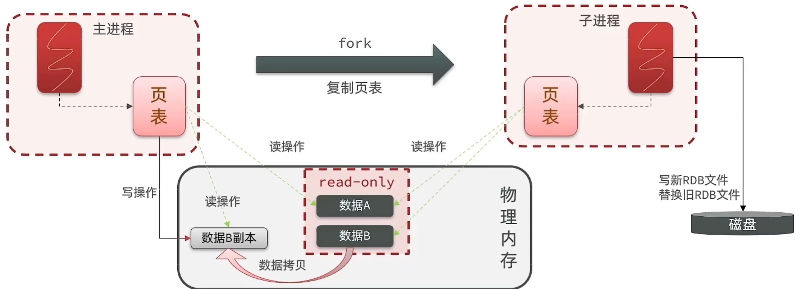

**总结：**

RDB方式bgsave的基本流程？

* fork主进程得到一个子进程，共享内存空间
* 子进程读取内存数据并写入新的RDB文件
* 用新RDB文件替换旧的RDB文件

RDB会在什么时候执行？ save 60 1000代表什么含义？

* 默认是服务停止时
* 代表60秒内至少执行1000次修改则触发RDB

RDB的缺点？

* RDB执行间隔时间长，两次RDB之间写入数据有丢失的风险
* fork子进程、压缩、写出RDB文件都比较耗时

### 1.3 AOF持久化

> AOF全称为Append Only File（追加文件）。Redis处理的每一个写命令都会记录在AOP文件，可以看做是命令日志文件。

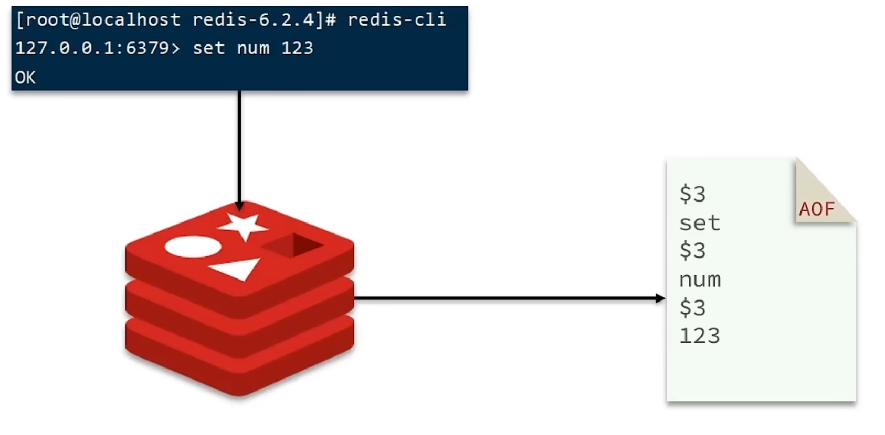

AOF默认是关闭的，需要修改redis.conf配置文件来开启AOF:

```sh
# 是否开启AOF功能，默认是no
appendonly yes
# AOF文件的名称
appendfilename "appendonly.aof"
```

AOF的命令记录的频率也可以通过redis.conf文件来配：

```sh
# 表示每执行一次写命令，立即记录到AOF文件
appendfsync always
# 写命令执行完先放入AOF缓冲区，然后表示每隔1秒将缓冲区数据写到AOF文件，是默认方案
appendfsync everysec
# 写命令执行完先放入AOF缓冲区，由操作系统决定何时将缓冲区内容写回磁盘
appendfsync no
```

|  配置项  |   刷盘时机   |           优点           |             缺点             |
| :------: | :----------: | :----------------------: | :--------------------------: |
|  Always  |   同步刷盘   | 可靠性高，几乎不丢失数据 |          性能影响大          |
| everysec |   每秒刷盘   |         性能适中         |       最多丢失1秒数据        |
|    no    | 操作系统控制 |         性能最好         | 可靠性较差，可能丢失大量数据 |

因为是记录命令，AOF文件会比RDB文件大的多。而且会记录同一个key的多次写操作，但只有最后一次写操作有意义。通过执行bgrewriteaof命令，可以让AOF文件执行重写功能，用最少的命令达到相同效果。

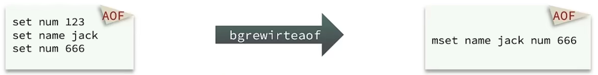

Redis也会在触发阈值时自动去重写AOF文件。阈值也可以在redis.conf中配置：

```sh
# AOF文件比上次文件 增长超过多少百分比则触发重写
auto-aof-rewrite-percentage 100
# AOF文件体积最小多大以上才触发重写
auto-aof-rewrite-min-size 64mb
```

### 1.4 RDB与AOF的对比

RDB和AOF各有自己的优缺点，如果对数据安全性能要求较高，在实际开发中往往会`结合`两者来使用。

|                | RDB                                          | AOF                                |
| -------------- | -------------------------------------------- | ---------------------------------- |
| 持久化方式     | 定时对整个内存做快照                         | 记录每一次执行的命令               |
| 数据完整性     | 不完整，两次备份之间会丢失                   | 相对完整，取决于刷盘策略           |
| 文件大小       | 会有压缩，文件体积小                         | 记录命令，文件体积很大             |
| 宕机恢复速度   | 很快                                         | 慢                                 |
| 数据恢复优先级 | 低，因为数据完整性不如AOF                    | 高，因为数据完整性更高             |
| 系统资源占用   | 高，大量COU和发个内存消耗                    | 但AOF重写时会占用大量CPU和内存资源 |
| 使用场景       | 可以容忍数分钟的数据丢失，追求更快的启动速度 | 对数据安全性要求较高常见           |

### 1.5 Redis主从集群

* 集群结构

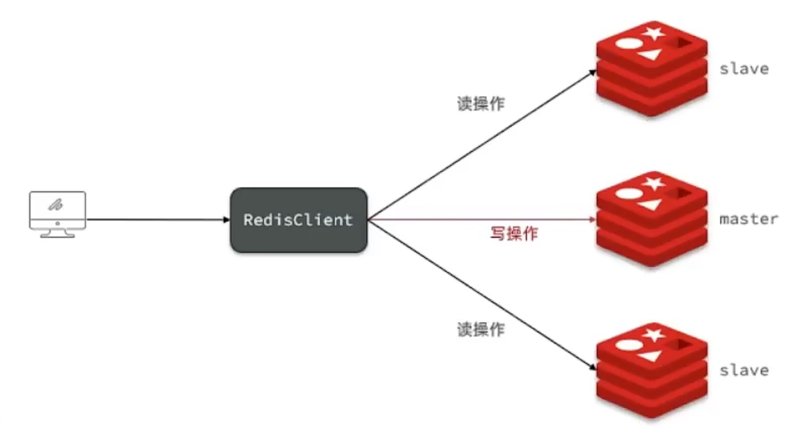


共包含了3个节点，一个主节点，两个从节点。3个redis实例，信息如下：

|      IP       | PORT |  角色  |
| :-----------: | :--: | :----: |
| 192.168.1.100 | 7001 | master |
| 192.168.1.100 | 7002 | slave  |
| 192.168.1.100 | 7003 | slave  |


### 1.6 全量同步原理

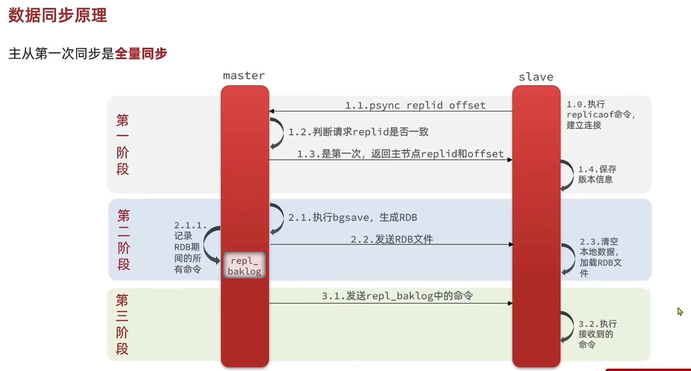

**数据同步原理**

master如何判断slave是不是第一次来同步数据？这里会用到两个很重要的概念：

* `Replication Id：`简称replid，是数据集的标记，id一致则说明是同一数据集。每一个master都有唯一的replid，slave则会继承master节点的replid
* `offset：`偏移量，随着记录在repl_baklog中的数据增多而逐渐增大。slave完成同步时也会记录当前同步的offset。如果slave的offset小于master的offset，说明slave数据后于master，需要更新。

因此slave做数据同步，必须向master声明自己的replication id和offset，master才可以判断到底需要同步哪些数据。

**思考一下**

master如何判断slave节点是不是第一次来做数据同步？

答：判断replid是否一致。

**简述全量同步的流程？**

* slave节点请求增量同步
* master节点判断replid，发现不一致，拒绝增量同步
* master将完整内存数据生成RDB，发送RDB到slave
* slave清空本地数据，加载master的RDB
* master将RDB期间的命令记录在repl_baklog，并持续将log中的命令送给slave
* slave执行接收到的命令，保持与master之间的同步

### 1.7 增量同步原理

主动第一次同步是全量同步，但如果是`slave重启`后同步，则执行`增量同步`

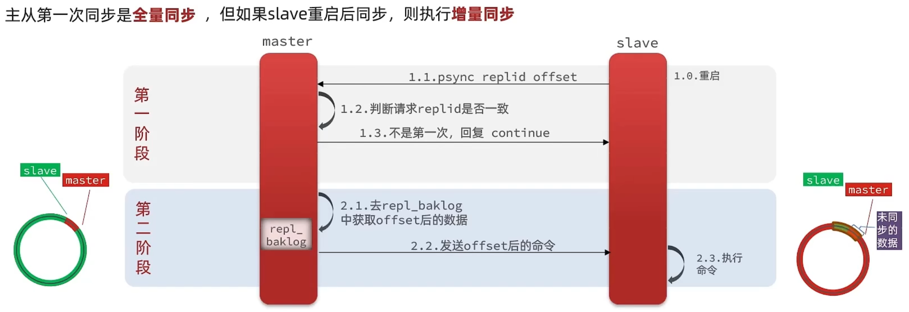

==注意==

repl_baklog大小有上限，写满后会覆盖最早的数据。如果slave断开时间过久，导致尚未备份的数据被覆盖，则无法基于log做增量同步，只能再次全量同步。


可以从以下几个方面来优化Redis主从集群：

* 在master中配置repl-diskless-sync yes启用磁盘复制，避免全量同步时的磁盘IO。
* Redis单节点上的内存占用不要太大，减少RDB导致的过多磁盘IO。
* 适当提高repl_baklog的大小，发现slave宕机时尽快实现故障恢复，尽可能避免全量同步。
* 限制一个master上的slave节点数量，如果实在是太多slave，则可以用主-从-从链式结构，减小master压力。

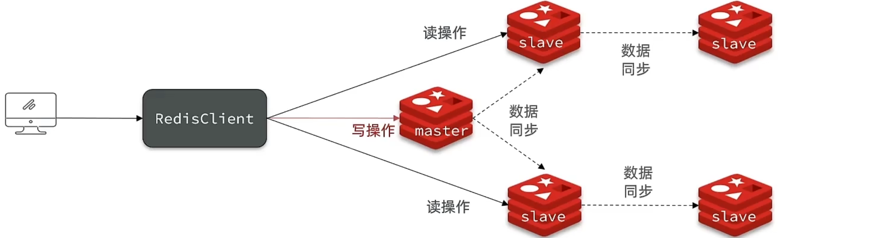

简述全量同步和增量同步区别？

* 全量同步：master将完整内存数据生成RDB，发送RDB到slave。后续命令则记录在repl_baklog，逐个发送给slave。
* 增量同步：slave提交自己的offset到master，master获取repl_baklog中从offset之后的命令给slave

什么时候执行全量同步？

* slave节点第一次连接master节点时
* slave节点断开时间太久，repl_baklog中的offset已经被覆盖时

什么时候执行增量同步？

* slave节点断开又恢复，并且在repl_baklog中能找到offset时


### 1.8 sentinel

**哨兵的作用**

Redis提供了哨兵（Sentinel）机制来实现主从集群的自动故障恢复。哨兵的结构和作用如下：

* **监控：**Sentinel会不断检查您的master和slave是否按预期工作
* **自动故障恢复：**如果master故障，Sentinel会将一个slave提升为master。当故障实例恢复后也以新的master为主。
* **通知：**Sentinel充当Redis客户端的服务发现来源，当集群发生故障转移时，会将最新信息推送给Redis的客户端。

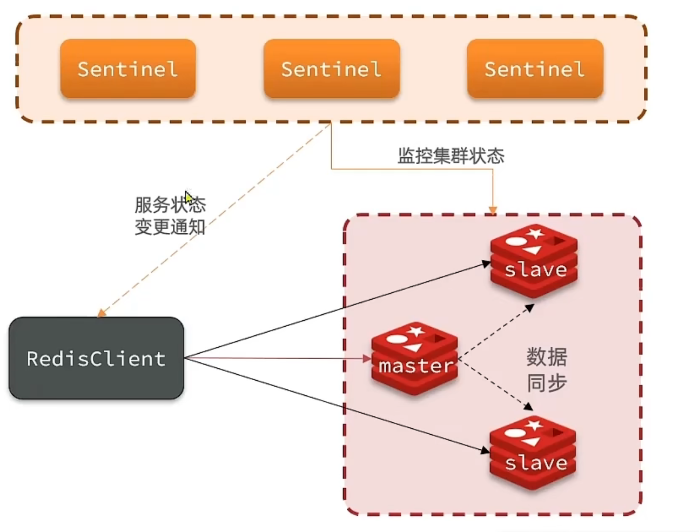

**服务状态监控**

Sentinel基于心跳机制监测服务状态，每隔1秒向集群的每个实例发送ping命令：

* 主观下线：如果某sentinel节点发现某实例未在规定时间响应，则认为该实例主观下线。
* 客观下线：若超过指定数量（quorum）的sentinel都认为该实例主观下线，则该实例客观下线。quorum值最好超过Sentinel实例数量的一半。

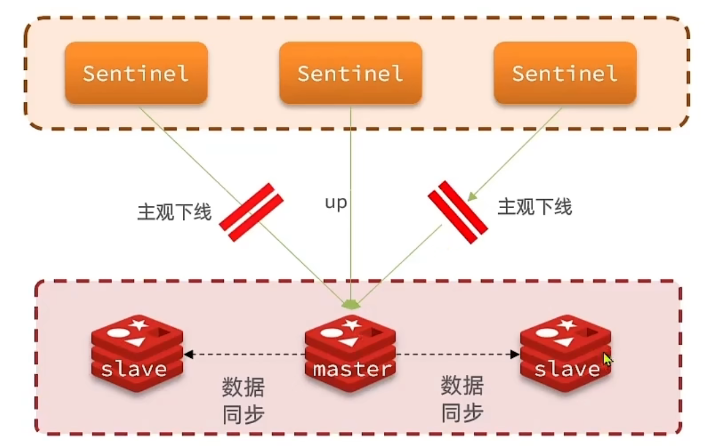

**选举新的master**

一旦发现master故障，sentinel需要在slave中选择一个作为新的master，选择依据是这样的：

* 首先会判断slave节点与master节点断开时间长短，如果超过指定值（down-after-milliseconds * 10）则会排除该slave节点。
* 然后判断slave节点的slave-priority值，越小优先级超高，如果是0则永不参与选举
* 如果slave-prority一样，则判断slave节点的offset值，越大说明数据越新，优先级越高。
* 最后是判断slave节点的运行id大小，越小优先级超高。

**如何实现故障转移**

当选中了其中一个slave为新的master后（例如slave1），故障的转移的步骤如下：

* sentinel给备选的slave1节点发送slaveof no one命令，让该节点成为master。
* sentinel给所有其它slave发送slaveof 192.168.150.101 7002命令，让这些slave成为新master的从节点，开始从新的master上同步数据。
* 最后，sentinel将故障节点标记为slave，当故障节点恢复后会自动成为新的master的slave

==总结==

sentinel的三个作用是什么？

* 监控
* 故障转移
* 通知

sentinel如何判断一个redis实例是否健康？

* 每隔1秒发送一次ping命令，如果超过一定时间没有响应则认为是主观下线。
* 如果大多数sentinel都认为实例主观下线，则判断服务下线

故障转移步骤有哪些？

* 首先选定一个slave作为新的master，执行slaveof no one
* 然后让所有节点都执行slaveof新的master
* 修改故障节点配置，添加slaveof新master

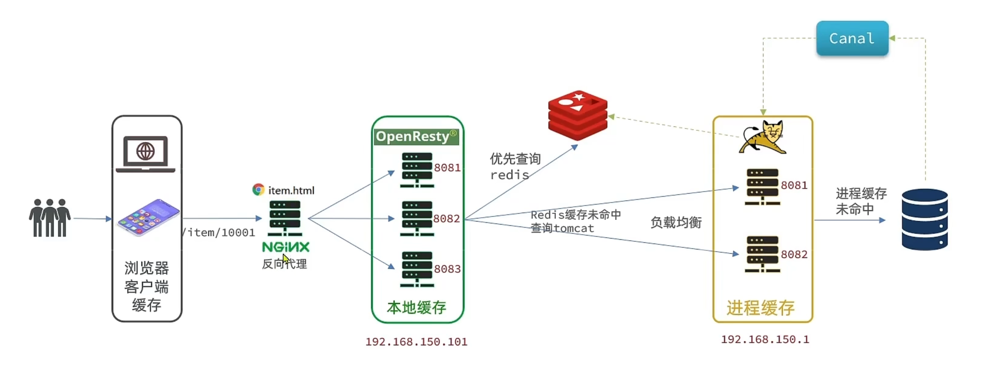

# redis原理篇

## 1. 动态字符串SDS

我们都知道Redis中保存的key是字符串，value往往是字符串的集合。可见字符串是Redis中最常用的一种数据结构。

不过Redis没有直接使用C语言的字符串，因为C语言字符串存在很多问题：

* 获取字符串长度的需要通过运算
* 非二进制安全
* 不可修改

Redis构建了一种的字符串结构，称为**简单动态字符串**（**S**imple **D**ynamic **S**tring），简称**`SDS`**

例如，我们执行命令：

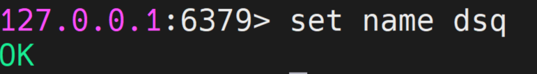

那么Redis将在底层创建两个SDS，其中一个是包含“name”的SDS，另一个是包含“dsq”的SDS


**动态字符串SDS**

Redis是C语言实现的，其中SDS是一个结构体，源码如下：

```C
struct __attribute__ ((__packed__)) sdshdr8{
    uint8_t len; /* buf 已保存的字符串节数，不包含结束标示*/
	uint8_t alloc; /* buf 申请的总的字节数，不包含结束标示*/
    unsigned char flags; /* 不同SDS的头类型，用来控制SDS的头大小*/
    char buf[];
}
```

SDS之所以叫做动态字符串，是因为它具备动态扩容的能力，例如一个内容为“hi”的SDS：


假如我们要给SDS追加一段“Amy”,这里首先会申请新内存空间：

* 如果新字符串小于1M，则新空间为扩展后字符串长度的两倍+1；
* 如果新字符串大于1M，则新空间为扩展后字符串长度+1M + 1。称为**内存预分配**。

`优点`

* 获取字符串长度的时间复杂度为O（1）
* 支持动态扩容
* 减少内存分配次数
* 二进制安全

## 2. IntSet

IntSet是Redis中set集合的一种实现方式，基于整数数组来实现，并且具备长度可变，有序等特征。

结构如下：

```C
typedef struct intset{
    uint32_t encoding; /* 编码方式，支持存放16位、32位、64位整数*/
    uint32_t length; /*元素个数*/
    int8_t contents[]; /*整数数组，保存集合数据*/
} intset;
```

为了方便查找，Redis会将intset中所有的整数按照升序依次保存在contents数组中，结构如图：

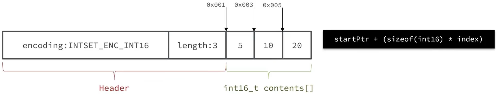

现在，数组中每个数字都在int16_t的范围内，因此采用的编码方式是INTSET_ENC_INT16，每部分占用的字节大小为：

* encoding：4字节
* length：4字节
* contents：2字节 * 3 = 6字节


**IntSet升级**

现在，假设有一个intset，元素为{5， 10， 20}，采用的编码是INTSET_ENC_INT16，则每个整数占2字节：

我们向该其中添加一个数字：50000，这个数字超出了int16_t的范围，intset会自动**升级**编码方式到合适的大小。

以当前案例来说流程如下：

* 升级编码为INTSET_ECN_INT32，每个整数占4个字节，并按照新的编码方式及元素个数扩容数组
* 倒序依次将数组中的元素拷贝到扩容后的正确位置
* 将待添加的元素放入数组末尾
* 最后，将intset的encoding属性改为INTSET_ENC_INT32，将length属性改为4


`总结`

Intset可以看做是特殊的整数数组，具备一些特点：

* Redis会确保Intset中的元素唯一，有序
* 具备类型升级机制，可以节省内存空间
* 底层采用二分查找方式来查询

## 3 Dict

## 4.ZipList

**ZipList**是一种特殊的“双端链表”，由一系列特殊编码的连续内存块组成。可以在你任意一端进行压入/弹出操作，并且该操作的时间复杂度为O(1)。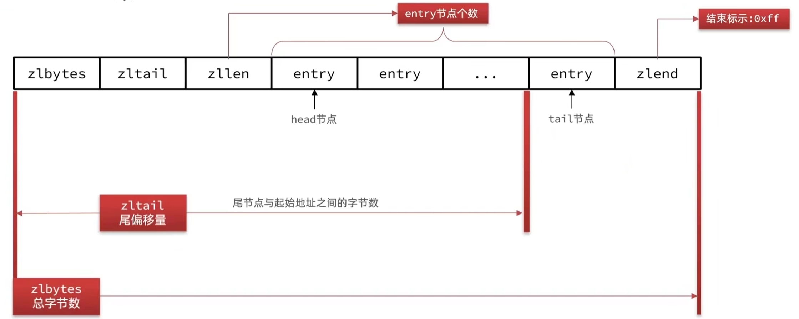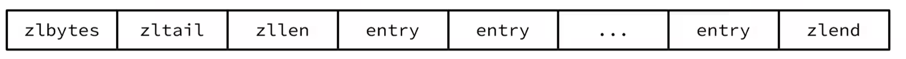

| 属性    | 类型     | 长度  | 用途                                                         |
| ------- | -------- | ----- | :----------------------------------------------------------- |
| zlbytes | uint32_t | 4字节 | 记录整个压缩列表占用的内存字节数                             |
| zltail  | uint32_t | 4字节 | 记录压缩列表表尾节点距离压缩列表的起始地址有多少字节，通过这个偏移量，<br />可以确定表尾节点的地址。 |
| zllen   | uint16_t | 2字节 | 记录压缩列表包含的节点数量。最大值为UINT16_MAX（65535），如果超过这个<br />值，此处会记录为65535，但节点的真实数量需要遍历整个压缩列表才能计算得出。 |
| entry   | 列表节点 | 不定  | 压缩列表包含的各个节点，节点的长度由节点保存的内容决定。     |
| zlend   | uint8_t  | 1字节 | 特殊值OxFF(十进制255 )，用于标记压缩列表的末端。             |

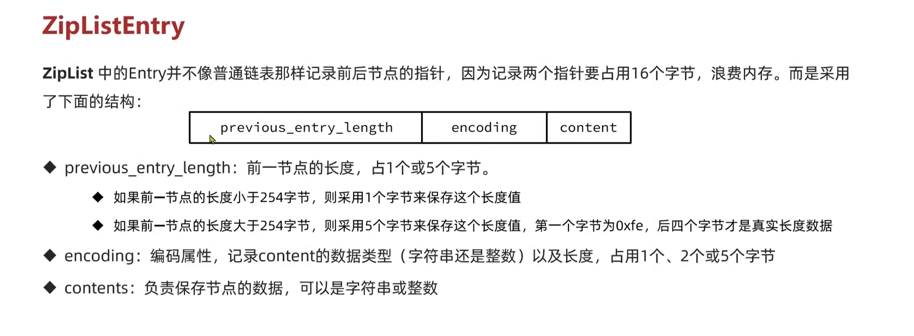


## 5QuickList

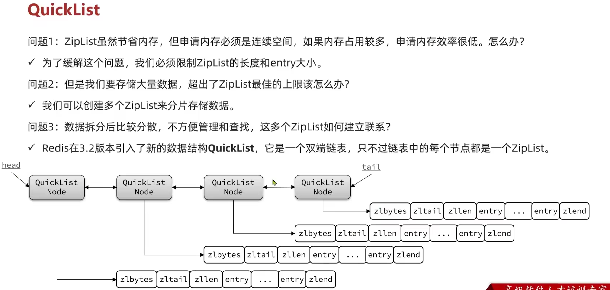

## 6.SkipList

## 7.RedisObject
