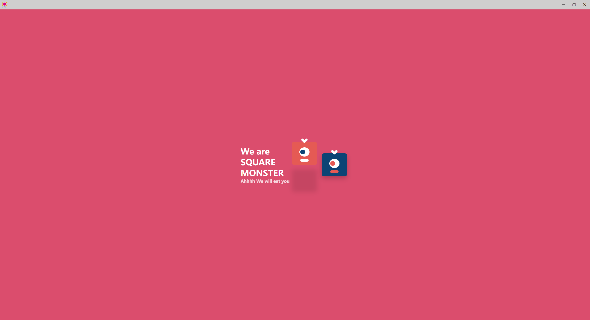

# Electron

## 1. Electron的生命周期

* ready: app初始化完成
* dom-ready: 一个窗口中的文本加载完成时触发
* did-finsh-load: 导航完成时触发
* window-all-closed: 所有窗口都被关闭时触发
* before-quit: 在窗口关闭之前触发
* will-quit: 在窗口关闭并且应用退出时触发
* quit: 当所有窗口被关闭时触发
* closed: 当窗口关闭时触发，此时应删除窗口引用

```js
const {app, BrowserWindow} = require('electron')

// 创建窗口
function createWindow() {
    let mainWin = new BrowserWindow({
        width: 800,
        height: 400
    })
    mainWin.loadFile('index.html')


    mainWin.webContents.on('did-finish-load', () => {
        console.log('3333------->did-finish-load')
    })

    mainWin.webContents.on('dom-ready', () => {
        console.log('2222------->dom-ready')
    })

    // 主窗口
    mainWin.on('close', () => {
        console.log('8888-------->this window is closed')
        mainWin = null
    })
}


app.on('ready', () => {
    console.log('1111------>ready')
    createWindow()
})

app.on('window-all-closed', () => {
    console.log('4444------->window-all-closed')
    app.quit()
})

app.on('before-quit', () => {
    console.log('5555------->before-quit')
})

app.on('will-quit', () => {
    console.log('6666------->will-quit')
})

app.on('quit', () => {
    console.log('7777------->quit')
})
```

## 2. 窗口大小

```js
let mainWin = new BrowserWindow({
    x: 100,
    y: 100,
    show: false, // 默认情况下创建一个窗口对象之后就会显示，设置为false就不会显示了
    width: 800,
    height: 400,
    maxHeight: 600,
    maxWidth: 1000,
    minHeight: 200,
    minWidth: 300,
    resizable:false, // 是否允许缩放窗口大小
})
```

## 3. 打开新窗口

由于<a href="https://www.electronjs.org/zh/docs/latest/breaking-changes#%E7%A7%BB%E9%99%A4-remote-%E6%A8%A1%E5%9D%97">remote已移除</a>，由[`@electronic/remote`](https://github.com/electron/remote) 模块替代。所以需要安装 `npm install @electron/remote --save`

* 在主进程(main.js)中

```js
const {app, BrowserWindow} = require('electron')

// 创建窗口
function createWindow() {
    let mainWin = new BrowserWindow({
        show: false, // 默认情况下创建一个窗口对象之后就会显示，设置为false就不会显示了
        width: 800,
        height: 400,
        title: "dsq",
        icon: "./image/favicon.ico",
        frame: true, // 是否显示导航菜单
        // transparent: true, // 透明度，设置之后会导致窗口不能缩放
        autoHideMenuBar: true, // 隐藏菜单
        webPreferences: {
            nodeIntegration: true,
            contextIsolation: false,
            enableRemoteModule: true, // 使用remote模块
        }

    })
    // 重点，需要设置
    require("@electron/remote/main").initialize(); // 初始化
    require("@electron/remote/main").enable(mainWin.webContents);

    mainWin.on('ready-to-show', () => {
        mainWin.show() 
    })
    mainWin.loadFile('index.html')
    // 主窗口
    mainWin.on('close', () => {
        console.log('mainWin is closed.')
        mainWin = null
    })
}

app.on('ready', createWindow)

app.on('window-all-closed', () => {
    console.log('all window is closed.')
    app.quit()
})

```

* 在渲染进程中设置

```js
// 引入@electron/remote
const { BrowserWindow } = require('@electron/remote')

window.addEventListener("DOMContentLoaded", () => {
    // 点击按钮打开一个新窗口
    const oBtn = document.getElementById('btn')
    oBtn.addEventListener('click', () => {
        // 如何去创建窗口
        let indexMin = new BrowserWindow({
            width: 200,
            height: 200,
        })
        indexMin.loadFile('list.html')
        indexMin.on("close", () => {
            indexMin = null
        })
    })
})
```

## 4. 自定义窗口

主进程(main.js)

```js
const {app, BrowserWindow} = require('electron')

// 创建窗口
function createWindow() {
    let mainWin = new BrowserWindow({
        show: false, // 默认情况下创建一个窗口对象之后就会显示，设置为false就不会显示了
        width: 800,
        height: 400,
        minWidth: 700,
        title: "dsq",
        icon: "./image/favicon.ico",
        frame: false, // 是否显示导航菜单
        // transparent: true, // 透明度，设置之后会导致窗口不能缩放
        autoHideMenuBar: true, // 隐藏菜单
        webPreferences: {
            nodeIntegration: true,
            contextIsolation: false,
            enableRemoteModule: true,
        }

    })
    require("@electron/remote/main").initialize(); // 初始化
    require("@electron/remote/main").enable(mainWin.webContents);

    mainWin.on('ready-to-show', () => {
        mainWin.show() 
    })
    mainWin.loadFile('index.html')
    // 主窗口
    mainWin.on('close', () => {
        console.log('mainWin is closed.')
        mainWin = null
    })
}

app.on('ready', createWindow)

app.on('window-all-closed', () => {
    console.log('all window is closed.')
    app.quit()
})

```

`index.html`

```html
<!DOCTYPE html>
<html lang="en">
<head>
    <meta charset="UTF-8">
    <meta name="viewport" content="width=device-width, initial-scale=1.0">
    <title></title>
    <link rel="stylesheet" href="css/index.css">
    <style>
        * {
            padding: 0;
            margin: 0;
        }
        html, body {
            width: 100%;
            height: 100%;
            

        }
        .wrapper {
            width: 100%;
        }
        .wrapper .nav {
            background-color: #cfcece;
            height: 40px;
            width: 100%;
            border-bottom: 1px solid #b1adad;
        }
    </style>
</head>
<body>
    <div class="wrapper">
        <div class="nav">
            <div class="menus">
                <i class="appicon"></i>

            </div>
            <div class="optBtn">
                <i class="iconfont minimize windowchange">&#xe65a;</i><i class="iconfont maximize windowchange">&#xe692;</i><i class="iconfont shutdown">&#xe661;</i>
            </div>
        </div>
        <div class="main">

        </div>
        <div class="flooter">

        </div>
    </div>


    <h2>窗口尺寸</h2>
    <button id = "btn">点击打开新窗口</button>
    <script src="./index.js"></script>
</body>
</html>
```

`index.css`

```css
@font-face {
    font-family: 'iconfont';
    src: url('../font/iconfont.woff2?t=1686043707654') format('woff2'),
         url('../font/iconfont.woff?t=1686043707654') format('woff'),
         url('../font/iconfont.ttf?t=1686043707654') format('truetype');
  }

.iconfont {
font-family: "iconfont" !important;
font-size: 16px;
font-style: normal;
-webkit-font-smoothing: antialiased;
-moz-osx-font-smoothing: grayscale;
}
.wrapper .nav .optBtn {
    float: right;
    user-select: none;
}
.wrapper .nav .optBtn .iconfont {
    height: 40px;
    line-height: 40px;
    display: inline-block;
    padding: 0 15px;
    user-select: none;

}
.wrapper .nav .optBtn .iconfont:hover {
    background-color: #e64f4f;
    cursor: pointer;
}
.wrapper .nav .optBtn .iconfont:active {
    background-color: #e96c6c;
    cursor: pointer;
}


.wrapper .nav .optBtn .windowchange:hover {
    background-color: #757575;
    cursor: pointer;
}
.wrapper .nav .optBtn .windowchange:active {
    background-color: #adadad;
    cursor: pointer;
}
.wrapper .nav .menus {
    width: calc(100% - 138px);
    height: 100%;
    float: left;
}
.wrapper .nav .menus .appicon {
    display: inline-block;
    width: 28px;
    height: 28px;
    margin: 6px;
    background-image: url(../image/favico.png);
    background-size: contain;
    
}
```

`index.js`

```js
const remote = require('@electron/remote')

// 利用 romote 可以获取当前窗口对象
let mainWin = remote.getCurrentWindow()
// 获取元素添加点击操作的监听
window.addEventListener('DOMContentLoaded', () => {
    let optBtnI = document.getElementsByClassName("optBtn")[0].getElementsByTagName("i")
    optBtnI[0].addEventListener('click', () => {
        // 最小化
        if(!mainWin.isMinimized()) {
            mainWin.minimize()
        }
    })
    optBtnI[1].addEventListener('click', () => {
        // 最大化
        if(!mainWin.isMaximized()) {
            mainWin.maximize()  // 让窗口最大化
        } else {
            mainWin.restore()   // 让窗口回到原来的状态
        }
    })
    optBtnI[2].addEventListener('click', () => {
        mainWin.close()
    })

})
```

## 5. 阻止窗口关闭

`index.js`

```js
const remote = require('@electron/remote')

// 利用 romote 可以获取当前窗口对象
let mainWin = remote.getCurrentWindow()
// 获取元素添加点击操作的监听
window.addEventListener('DOMContentLoaded', () => {

    window.onbeforeunload = function () {
        let bulletbox = document.getElementsByClassName("bulletbox")[0]
        bulletbox.style.display = 'block'
        let yesBtn = bulletbox.getElementsByTagName("button")[0]
        let noBtn = bulletbox.getElementsByTagName("button")[1]
        yesBtn.addEventListener("click", () => {
            mainWin.destroy()
        })
        noBtn.addEventListener("click", () => {
            bulletbox.style.display = 'none'
        })

        return false;
    }

    let optBtnI = document.getElementsByClassName("optBtn")[0].getElementsByTagName("i")
    optBtnI[0].addEventListener('click', () => {
        // 最小化
        if(!mainWin.isMinimized()) {
            mainWin.minimize()
        }
    })
    optBtnI[1].addEventListener('click', () => {
        // 最大化
        if(!mainWin.isMaximized()) {
            mainWin.maximize()  // 让窗口最大化
        } else {
            mainWin.restore()   // 让窗口回到原来的状态
        }
    })
    optBtnI[2].addEventListener('click', () => {
        mainWin.close()
    })
})
```

## 6. 模态窗口

`index.js`

```js
let indexMin = new remote.BrowserWindow({
    parent: remote.getCurrentWindow(),
    width: 500,
    height: 300,
    modal: true,

})
```

## 7. 自定义菜单

`main.js`

```js
// 1. 定义自己需要的菜单项
    let menuTemp = [
        {
            label: '文件',
            submenu: [
                {
                    label : '打开文件',
                    click() {
                        console.log('当前需要做的就是打开某一个具体的文件')
                    }
                },
                {
                    type : 'separator'
                },
                {
                    label : '关闭文件夹'
                },
                {
                    type : 'separator'
                },
                {
                    label : '关于',
                    role: 'about'
                }
            ]
        },
        {label: '编辑'}

    ]
    // 2. 利用上述的模板然后生成一个菜单项
    let menu = Menu.buildFromTemplate(menuTemp)

    // 3. 将上述的自定义菜单添加到应用里
    Menu.setApplicationMenu(menu)
```

## 8. 菜单角色及类型

```js
// 定义自己需要的菜单项
    let menuTemp = [
        {
            label: '文件',
            submenu: [
                {
                    label : '打开文件',
                    click() {
                        console.log('当前需要做的就是打开某一个具体的文件')
                    }
                },
                {
                    type : 'separator'
                },
                {
                    label : '关闭文件夹'
                },
                {
                    type : 'separator'
                },
                {
                    label : '关于',
                    role: 'about'
                }
            ]
        },
        {label: '编辑'},
        {
            label: '角色',
            submenu: [
                {
                    label: '复制',
                    role: 'copy',
                },
                {
                    label: '剪切',
                    role: 'cut',
                },
                {
                    label: '粘贴',
                    role: 'paste',
                },
                {
                    label: '最小化',
                    role: 'minimize',
                },
                
                
            ]
        },
        {
            label: '类型',
            submenu: [
                {
                    label: '选项1',
                    type: 'checkbox',
                },
                {
                    label: '选项2',
                    type: 'checkbox',
                },
                {
                    label: '选项3',
                    type: 'checkbox',
                },
                {type: "separator"},
                {
                    label: 'item1',
                    type: 'radio'
                },
                {
                    label: 'item2',
                    type: 'radio'
                },
                {type: "separator"},
                {
                    label: "windows",
                    type: 'submenu',
                    role: "windowMenu"
                }
            ]
        }

    ]
    // 利用上述的模板然后生成一个菜单项
    let menu = Menu.buildFromTemplate(menuTemp)

    // 将上述的自定义菜单添加到应用里
    Menu.setApplicationMenu(menu)
```


