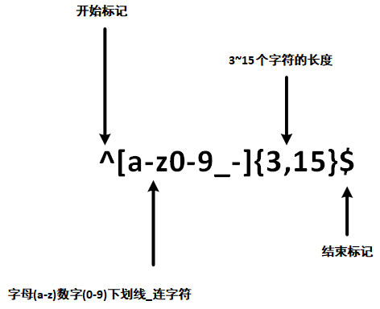
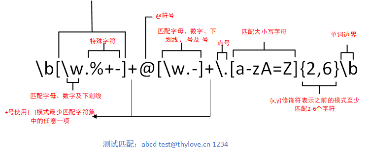

---
# 当前页面内容标题
title: 正则表达式
# 当前页面图标
icon: regexp
# 分类
category:
  - 后端
  - java
  - python
  - 前端
  - javascript
# 标签
tag:
  - 正则表达式
sticky: false
# 是否收藏在博客主题的文章列表中，当填入数字时，数字越大，排名越靠前。
star: false
# 是否将该文章添加至文章列表中
article: false
# 是否将该文章添加至时间线中
timeline: false
---


# Regular Expression

## 正则表达式


> ​	正则表达式(Regular Expression)是一种文本模式，包括普通字符(例如，a到z之间的字母)和特殊字符(称为“元字符”)，可以用来描述和匹配字符串的特定模式。
>
> ​	正则表达式是一种用于模式匹配和搜索文本的工具。
>
> ​	正则表达式提供了一种灵活且强大的方式来查找、替换、验证和提取文本数据。
>
> ​	正则表达式可以应用于各种编程语言和文本处理工具中，如JavaScript、Python、Java、Perl等。

### 实例

以下实例从字符串str中找出数字：

```js
var str = "abc123def";
var patt1 = /[0-9]+/;
console.log(str.match(patt1)) // 123
```

### 正则表达式的模式

正则表达式的模式可以包括以下内容：

* 字面值字符：例如字母、数字、空格等，可以直接匹配它们自身。
* 特殊字符：例如点号**.**、星号*****、加号**+**、问号**?**等，它们具有特殊的含义和功能。
* 字符类：用方括号**[ ]**包围的字符集合，用于匹配方括号内的任意一个字符。
* 元字符：例如\d、\w、\s等，用于匹配特定类型的字符，如数字、字母、空白等。
* 量词：例如{n}、{n,}、{n, m}等，用于指定匹配的次数或范围。
* 边界符号：例如**^**、$、\b、\B等，用于匹配字符串开头、结尾或单词边界位置。

## 简介

> ​	除非您以前使用过正则表达式，否则您可能不熟悉一些术语。但是。毫无疑问你已经使用过不涉及脚本的某些正则表达式概念。

例如，您很可能使用`?`和`*`通配符来查找硬盘上的文件。`?` 通配符匹配文件名中的0个或1个字符，而`*`通配符匹配零个或多个字符。像`data(\w)?\.dat`这样的模式将查找下列文件：

**实例**

```tex
data.dat
data1.dat
data2.dat
datax.dat
dataN.dat
```

使用`*`字符代替`?`字符扩大了找到的文件的数量。`data.*\.dat`匹配下列所有文件：

**实例**

```tex
data.dat
data1.dat
data2.dat
data12.dat
datax.dat
dataXYZ.dat
```

尽管这种搜索方法很有用，但它还是有限的。通过理解`*`通配符的工作原理，引入了正则表达式所依赖的概念，但正则表达式功能更强大，而且更加灵活。

正则表达式的使用，可以通过简单的办法来实现强大的功能。下面先给出一个简单的示例。

<span style="font-size: 30px; font-weight: 900;padding: 10px">\^\[0-9]+abc$</span>

* `^`为匹配输入字符串的开始位置。
* `[0-9]+`匹配多个数字，`[0-9]`匹配单个数字，`+`匹配一个或者多个
* `abc$`匹配字母`abc`并以`abc`结尾，`$`为匹配输入字符串的结束位置。

我们在写用户注册表单时，只允许用户名包含字符、数字、下划线和软连接字符`-`，并设置用户名的长度，我们就可以使用以下正则表达式来设定。




以上的正则表达式可以匹配`thylove`、`thylove1`、`thy-love`、`thy_love`，但不匹配`th`，因为它包含的字母太短了，小于3个无法匹配。也不匹配thylove$，因为它包含特殊字符。

**实例**

```js
// 匹配以数字开头，并以abc结尾的字符串。
var str = "123abc";
var patt1 = /^[0-9]+abc$/;
console.log(str.match(patt1))
```

### 正则表达式元字符和特性

#### 字符匹配

* 普通字符：普通字符按照字面意义进行匹配，例如匹配字母"a"将匹配到文本中的"a"字符。
* 元字符：元字符具有特殊的含义，例如\d匹配任意数字字符，\w匹配任意字母数字字符，.匹配任意字符(除了换行符)等。

#### 量词

* *: 匹配前面的模式零次或多次。
* +: 匹配前面的模式一次或多次
* ?: 匹配前面的模式零次或一次
* {n}: 匹配前面的模式恰好n次
* {n, }: 匹配前面的模式至少n次。
* {n,m}: 匹配前面的模式至少n次且不超过m次。

#### 字符类

* \[ ]: 匹配括号内的任意一个字符。例如，[abc]匹配字符"a"、"b"或"c"。
* \[^ ]: 匹配除了括号内的字符以外的任意一个字符。例如，\[^abc] 匹配除了字符"a"、"b"或"c"以外的任意字符。

#### 边界匹配

* ^: 匹配字符串的开头。
* $: 匹配字符串的结尾。
* \b: 匹配单词边界。
* \B: 匹配非单词边界。

#### 分组和捕获

* ( ): 用于分组和捕获子表达式
* (?: ): 用于分组但不捕获子表达式。

#### 特殊字符

* \: 转义字符，用于匹配特殊字符本身。
* .: 匹配任意字符(除了换行符)。
* |: 用于指定多个模式的选择。

### 为什么使用正则表达式？

典型的搜索各替换操作要求您提供与预期的搜索结果匹配的确切文本。虽然这种技术对于静态文本执行简单搜索和替换任务可能已经足够了，但它缺乏灵活性，若采用这种方法搜索动态文本，即使不是不可能，开弓没有回头箭也会变得很困难。

通过使用正则表达式，可以：

* 测试字符串内的模式。
  * 例如，可以测试输入字符串，以查看字符串内是否出现电话号码模式或信用卡号码模式。这称为数据验证。
* 替换文本。
  * 可以使用正则表达式来识别文档中的特定文本，完全删除该文本或者用其他文本替换它。
* 基于模式匹配从字符串中提取子字符串。
  * 可以查找文档内或输入域内特定的文本。

| 命令或环境 | .                  | []                 | ^                  | $                  | \\(\\)             | \\{\\}                                                       | ?                  | +                  | \|                 | ()                 |
| ---------- | ------------------ | ------------------ | ------------------ | ------------------ | ------------------ | ------------------------------------------------------------ | ------------------ | ------------------ | ------------------ | ------------------ |
| vi         | :heavy_check_mark: | :heavy_check_mark: | :heavy_check_mark: | :heavy_check_mark: | :heavy_check_mark: |                                                              |                    |                    |                    |                    |
| Visual C++ | :heavy_check_mark: | :heavy_check_mark: | :heavy_check_mark: | :heavy_check_mark: | :heavy_check_mark: |                                                              |                    |                    |                    |                    |
| awk        | :heavy_check_mark: | :heavy_check_mark: | :heavy_check_mark: | :heavy_check_mark: |                    | awk是支持语法的，只是要在命令行加入 --posix or --re-interval参数即可，可见man awk中的interval expression | :heavy_check_mark: | :heavy_check_mark: | :heavy_check_mark: | :heavy_check_mark: |
| sed        | :heavy_check_mark: | :heavy_check_mark: | :heavy_check_mark: | :heavy_check_mark: | :heavy_check_mark: | :heavy_check_mark:                                           |                    |                    |                    |                    |
| delphi     | :heavy_check_mark: | :heavy_check_mark: | :heavy_check_mark: | :heavy_check_mark: | :heavy_check_mark: |                                                              | :heavy_check_mark: | :heavy_check_mark: | :heavy_check_mark: | :heavy_check_mark: |
| python     | :heavy_check_mark: | :heavy_check_mark: | :heavy_check_mark: | :heavy_check_mark: | :heavy_check_mark: | :heavy_check_mark:                                           | :heavy_check_mark: | :heavy_check_mark: | :heavy_check_mark: | :heavy_check_mark: |
| java       | :heavy_check_mark: | :heavy_check_mark: | :heavy_check_mark: | :heavy_check_mark: | :heavy_check_mark: | :heavy_check_mark:                                           | :heavy_check_mark: | :heavy_check_mark: | :heavy_check_mark: | :heavy_check_mark: |
| javascript | :heavy_check_mark: | :heavy_check_mark: | :heavy_check_mark: | :heavy_check_mark: | :heavy_check_mark: |                                                              | :heavy_check_mark: | :heavy_check_mark: | :heavy_check_mark: | :heavy_check_mark: |
| php        | :heavy_check_mark: | :heavy_check_mark: | :heavy_check_mark: | :heavy_check_mark: | :heavy_check_mark: |                                                              |                    |                    |                    |                    |
| perl       | :heavy_check_mark: | :heavy_check_mark: | :heavy_check_mark: | :heavy_check_mark: | :heavy_check_mark: |                                                              | :heavy_check_mark: | :heavy_check_mark: | :heavy_check_mark: | :heavy_check_mark: |
| C#         | :heavy_check_mark: | :heavy_check_mark: | :heavy_check_mark: | :heavy_check_mark: |                    |                                                              | :heavy_check_mark: | :heavy_check_mark: | :heavy_check_mark: | :heavy_check_mark: |

## 语法

> ​	正则表达式是一种用于匹配和操作文本的强大工具，它是由一系列字符和特殊字符组成的模式，用于描述要匹配的文本模式。
>
> 正则表达式可以在文本中查找、替换、提取和验证特定的模式。

例如：

* **thylov+y**，可以匹配thylove、thylovve、thylovvvvvve等，`+`号代表前面的字符必须至少出现一次(1次或多次)
* **thylovv*b**，可以匹配thylove、thylovve、thylovvvvvve等，`*`号代表前面的字符可以不出现，也可以出现一次或者多次(0次、或1次、或多次)
* **thylovv?e**，可以匹配thylove或者thylovve，`?`问号代表前面的字符最多只可以出现一次(0次或1次)

构造正则表达式的方法和创建数学表达式的方法一样。也就是用多种元字符与运算符可以将小的表达式结合在一起来创建更大的表达式。正则表达式的组件可以是单个的字符、字符集合、字符范围、字符间的选择或者所有这些组件的任意组合。

正则表达式是由普通字符(例如字符a到z)以及特殊字符(称为"元字符")组成的文字模式。模式描述在搜索文本时要匹配的一个或多个字符串。正则表达式作为一个模板，将某个字符模式与所搜索的字符串进行匹配。

###  普通字符

普通字符包括没有显式指定为元字符的所有可打印和不可打印字符。这包括所有大写和小写字母、所有数字、所有标点符号和一些其他符号。

| 字符     | 描述                                                         |
| -------- | ------------------------------------------------------------ |
| `[ABC]`  | 匹配[...]中的所有字符，例如[aeiou]匹配字符串"google dengshiqiang thylove"中所有的 a e i o字母。<br /><span style="letter-spacing:2px;">g<span style="background-color: #b0dfe7;margin-right:1px">o</span><span style="background-color: #b0dfe7;">o</span>gl<span style="background-color: #b0dfe7;margin-right:1px">e</span><span style="color:#CCCACAFF; font-size:40px;vertical-align: -8px;">·</span>d<span style="background-color: #b0dfe7;margin-right:1px">e</span>ngsh<span style="background-color: #b0dfe7;margin-right:1px">i</span>q<span style="background-color: #b0dfe7;margin-right:1px">i</span><span style="background-color: #b0dfe7;margin-right:1px">a</span>ng<span style="color:#CCCACAFF; font-size:40px;vertical-align: -8px;">·</span>thyl<span style="background-color: #b0dfe7;margin-right:1px">o</span>v<span style="background-color: #b0dfe7;margin-right:1px">e</span></span> |
| `[^ABC]` | 匹配除了[...]中字符的所有字符，例如\[^aeiou]匹配字符串"google dengshiqiang thylove"中除了a e i o字母的所有字符。<br/><span style="letter-spacing:2px;"><span style="background-color: #b0dfe7;">G</span>oo<span style="background-color: #b0dfe7;margin-right:1px">g</span><span style="background-color: #b0dfe7;margin-right:1px">l</span>e<span style="color:#CCCACAFF; font-size:40px;vertical-align: -8px;">·</span><span style="background-color: #b0dfe7;margin-right:1px">d</span>e<span style="background-color: #b0dfe7;margin-right:1px">n</span><span style="background-color: #b0dfe7;margin-right:1px">g</span><span style="background-color: #b0dfe7;margin-right:1px">s</span><span style="background-color: #b0dfe7;margin-right:1px">h</span>i<span style="background-color: #b0dfe7;margin-right:1px">q</span>ia<span style="background-color: #b0dfe7;margin-right:1px">n</span><span style="background-color: #b0dfe7;margin-right:1px">g</span><span style="color:#CCCACAFF; font-size:40px;vertical-align: -8px;">·</span><span style="background-color: #b0dfe7;margin-right:1px">t</span><span style="background-color: #b0dfe7;margin-right:1px">h</span><span style="background-color: #b0dfe7;margin-right:1px">y</span><span style="background-color: #b0dfe7;margin-right:1px">l</span>o<span style="background-color: #b0dfe7;margin-right:1px">v</span>e</span> |
| `[A-Z]`  | [A-z]表示一个区间，匹配所有大写字母，[a-z]表示所有小写字母。<br><span style="letter-spacing:2px;"><span style="background-color: #b0dfe7;">G</span>oogle<span style="color:#CCCACAFF; font-size:40px;vertical-align: -8px;">·</span><span style="background-color: #b0dfe7;margin-right:1px">D</span>engshiqiang<span style="color:#CCCACAFF; font-size:40px;vertical-align: -8px;">·</span><span style="background-color: #b0dfe7;margin-right:1px">T</span>hylove</span> |
| `.`      | 匹配除换行符(\n、\r)之外的任何单个字符，相等于\[^\n\r]<br/><span style="letter-spacing:2px;"><span style="background-color: #b0dfe7;margin-right:1px">G</span><span style="background-color: #b0dfe7;margin-right:1px">o</span><span style="background-color: #b0dfe7;margin-right:1px">o</span><span style="background-color: #b0dfe7;margin-right:1px">g</span><span style="background-color: #b0dfe7;margin-right:1px">l</span><span style="background-color: #b0dfe7;margin-right:1px">e</span><span style="color:#CCCACAFF; background-color: #b0dfe7;margin-right:1px"> </span><span style="background-color: #b0dfe7;margin-right:1px">D</span><span style="background-color: #b0dfe7;margin-right:1px">e</span><span style="background-color: #b0dfe7;margin-right:1px">n</span><span style="background-color: #b0dfe7;margin-right:1px">g</span><span style="background-color: #b0dfe7;margin-right:1px">s</span><span style="background-color: #b0dfe7;margin-right:1px">h</span><span style="background-color: #b0dfe7;margin-right:1px">i</span><span style="background-color: #b0dfe7;margin-right:1px">q</span><span style="background-color: #b0dfe7;margin-right:1px">i</span><span style="background-color: #b0dfe7;margin-right:1px">a</span><span style="background-color: #b0dfe7;margin-right:1px">n</span><span style="background-color: #b0dfe7;margin-right:1px">g</span><span style="color:#CCCACAFF; background-color: #b0dfe7;margin-right:1px"> </span><span style="background-color: #b0dfe7;margin-right:1px">t</span><span style="background-color: #b0dfe7;margin-right:1px">h</span><span style="background-color: #b0dfe7;margin-right:1px">y</span><span style="background-color: #b0dfe7;margin-right:1px">l</span><span style="background-color: #b0dfe7;margin-right:1px">o</span><span style="background-color: #b0dfe7;margin-right:1px">v</span><span style="background-color: #b0dfe7;margin-right:1px">e</span></span> |
| `[\s\S]` | 匹配所有。\s是匹配所有空白符，包括换行，\S非空白符，不包括换行。<br/><span style="letter-spacing:2px;"><span style="background-color: #b0dfe7;margin-right:1px">G</span><span style="background-color: #b0dfe7;margin-right:1px">o</span><span style="background-color: #b0dfe7;margin-right:1px">o</span><span style="background-color: #b0dfe7;margin-right:1px">g</span><span style="background-color: #b0dfe7;margin-right:1px">l</span><span style="background-color: #b0dfe7;margin-right:1px">e</span><span style="color:#CCCACAFF; background-color: #b0dfe7;margin-right:1px"> </span><span style="background-color: #b0dfe7;margin-right:1px">D</span><span style="background-color: #b0dfe7;margin-right:1px">e</span><span style="background-color: #b0dfe7;margin-right:1px">n</span><span style="background-color: #b0dfe7;margin-right:1px">g</span><span style="background-color: #b0dfe7;margin-right:1px">s</span><span style="background-color: #b0dfe7;margin-right:1px">h</span><span style="background-color: #b0dfe7;margin-right:1px">i</span><span style="background-color: #b0dfe7;margin-right:1px">q</span><span style="background-color: #b0dfe7;margin-right:1px">i</span><span style="background-color: #b0dfe7;margin-right:1px">a</span><span style="background-color: #b0dfe7;margin-right:1px">n</span><span style="background-color: #b0dfe7;margin-right:1px">g</span><span style="color:#CCCACAFF; background-color: #b0dfe7;margin-right:1px"> </span><span style="background-color: #b0dfe7;margin-right:1px">t</span><span style="background-color: #b0dfe7;margin-right:1px">h</span><span style="background-color: #b0dfe7;margin-right:1px">y</span><span style="background-color: #b0dfe7;margin-right:1px">l</span><span style="background-color: #b0dfe7;margin-right:1px">o</span><span style="background-color: #b0dfe7;margin-right:1px">v</span><span style="background-color: #b0dfe7;margin-right:1px">e</span></span><br/><span style="letter-spacing:2px;"><span style="background-color: #b0dfe7;margin-right:1px">D</span><span style="background-color: #b0dfe7;margin-right:1px">e</span><span style="background-color: #b0dfe7;margin-right:1px">n</span><span style="background-color: #b0dfe7;margin-right:1px">g</span><span style="background-color: #b0dfe7;margin-right:1px">s</span><span style="background-color: #b0dfe7;margin-right:1px">h</span><span style="background-color: #b0dfe7;margin-right:1px">i</span><span style="background-color: #b0dfe7;margin-right:1px">q</span><span style="background-color: #b0dfe7;margin-right:1px">i</span><span style="background-color: #b0dfe7;margin-right:1px">a</span><span style="background-color: #b0dfe7;margin-right:1px">n</span><span style="background-color: #b0dfe7;margin-right:1px">g</span><br/><span style="background-color: #b0dfe7;margin-right:1px">t</span><span style="background-color: #b0dfe7;margin-right:1px">h</span><span style="background-color: #b0dfe7;margin-right:1px">y</span><span style="background-color: #b0dfe7;margin-right:1px">l</span><span style="background-color: #b0dfe7;margin-right:1px">o</span><span style="background-color: #b0dfe7;margin-right:1px">v</span><span style="background-color: #b0dfe7;margin-right:1px">e</span></span> |
| `\w`     | 匹配字母、数字、下划线。等价于[A-Za-z0-9]<br/><span style="letter-spacing:2px;"><span style="background-color: #b0dfe7;margin-right:1px">G</span><span style="background-color: #b0dfe7;margin-right:1px">o</span><span style="background-color: #b0dfe7;margin-right:1px">o</span><span style="background-color: #b0dfe7;margin-right:1px">g</span><span style="background-color: #b0dfe7;margin-right:1px">l</span><span style="background-color: #b0dfe7;margin-right:1px">e</span><span style="color:#CCCACAFF; margin-right:1px"> </span><span style="background-color: #b0dfe7;margin-right:1px">D</span><span style="background-color: #b0dfe7;margin-right:1px">e</span><span style="background-color: #b0dfe7;margin-right:1px">n</span><span style="background-color: #b0dfe7;margin-right:1px">g</span><span style="background-color: #b0dfe7;margin-right:1px">s</span><span style="background-color: #b0dfe7;margin-right:1px">h</span><span style="background-color: #b0dfe7;margin-right:1px">i</span><span style="background-color: #b0dfe7;margin-right:1px">q</span><span style="background-color: #b0dfe7;margin-right:1px">i</span><span style="background-color: #b0dfe7;margin-right:1px">a</span><span style="background-color: #b0dfe7;margin-right:1px">n</span><span style="background-color: #b0dfe7;margin-right:1px">g</span><span style="color:#CCCACAFF; margin-right:1px"> </span><span style="background-color: #b0dfe7;margin-right:1px">t</span><span style="background-color: #b0dfe7;margin-right:1px">h</span><span style="background-color: #b0dfe7;margin-right:1px">y</span><span style="background-color: #b0dfe7;margin-right:1px">l</span><span style="background-color: #b0dfe7;margin-right:1px">o</span><span style="background-color: #b0dfe7;margin-right:1px">v</span><span style="background-color: #b0dfe7;margin-right:1px">e</span></span> |

### 非打印字符

非打印字符也可以是正则表达式的组成部分。下表列出了表示非打印字符的转义序列：

| 字符 | 描述                                                         |
| ---- | ------------------------------------------------------------ |
| \cx  | 匹配由x指明的控制字符。例如，\cM匹配一个Control-M或回车符。x的值必须为A-Z或a-z之一。否则，将c视为一个原义的'c'字符。 |
| \f   | 匹配一个换页符。等价于\x0c和\cL。                            |
| \n   | 匹配一个换行符。等价于\x0a和\cJ。                            |
| \r   | 匹配一个回车符。等价于\x0d和\cM。                            |
| \s   | 匹配任何空白字符，包括空格、制表符、换页符等待。等价于[\f\n\r\t\v]。注意Unicode正则表达式会匹配全角空格符。 |
| \S   | 匹配任何非空白字符。等价于[^\f\n\r\t\v\]。                   |
| \t   | 匹配一个制表符。等价于\x09和\cl。                            |
| \v   | 匹配一个垂直制表符。等价于\x0b和\cK。                        |

### 特殊字符

所谓特殊字符，就是一些有特殊含义的字符，如上面说的`thylov*e`中的`*`，简单的说就是表示任何字符串的意思。如果要查找字符串中的`*`符号，则需要对`*`进行转义。即在其前加一个`\`，`thylov\*e`匹配字符串thylov*e。

许多元字符要求在试图匹配它们时特别对待。若要匹配这些特殊字符，必须首先使字符"转义"，即，将反斜杠字符`\`放在它们前面。下表列出了正则表达式中的特殊字符：

| 特别字符 | 描述                                                         |
| -------- | ------------------------------------------------------------ |
| $        | 匹配输入字符串的结尾位置。如果设置了RegExp对象的Multiline属性，则\$也匹配'\n'或'\r'。要匹配\$字符本身，请使用\\$。 |
| ()       | 标记一个子表达式的开始和结束位置。子表达式可以获取供以后使用。要匹配这些字符，请使用\\(和\\)。 |
| *        | 匹配前面的子表达式零次或多次。要匹配\*字符，请使用\\*。      |
| +        | 匹配前面的子表达式一次或多次。要匹配+字符，请使用\\+。       |
| .        | 匹配除了换行符\n之外的任何单字符。要匹配.，请使用\\.。       |
| [        | 标记一个中括号表达式的开始。要匹配[，请使用\\[。             |
| ?        | 匹配前面的子表达式零次或一次，或指明一个非贪婪限定符。要匹配?字符，请使用\\?。 |
| \        | 将下一个字符标记为或特殊字符、或原义字符、或向后引用、或八进制转义符。例如，'n'匹配字符'n'。'\n'匹配换行符。序列'\\\\'匹配'\\'，而'\\('则匹配"("。 |
| ^        | 匹配输入字符串的开始位置，除非在方括号表达式中使用，当该符号在方括号表达式中使用时，表示不接受该方括号表达式中的字符集合。要匹配\^字符本身，请使用\\\^。 |
| {        | 标记限定符表达式的开始。要匹配{，请使用\\{。                 |
| \|       | 指明两项之间的一个选择。要匹配\|，请使用\\|。                |

### 限定符

限定符用来指定正则表达式的一个给定组件必须要出现多少次才能满足匹配。有`*`或`+`或`?`或`{n}`或`{n, }`或`{n,m}`共6种。

正则表达式的限定符有：

| 字符    | 描述                                                         |
| ------- | ------------------------------------------------------------ |
| *       | 匹配前面的子表达式零次或多次。例如，`zo*`能匹配"z"以及"zoo"。`*`等价于{0,}。 |
| +       | 匹配前面的子表达式一次或多次。例如，`zo+`能匹配"zo"以及"zoo"，但不能匹配"z"。`+`等价于`{1,}`。 |
| ？      | 匹配前面的子表达式零次或一次。例如，`do(es)?`可以匹配"do"、"does"、"doxy"中的"do"和"does"。`?`等价于`{0,1}`。 |
| \{n\}   | n是一个非负数整数。匹配确定的n次。例如，`o{2}`不能匹配"Bob"中o，但是级匹配"food"中的两个o。 |
| \{n,\}  | n是一个非负整数。至少匹配n次。例如，`o{2,}`不能匹配"Bob"中的o，但能匹配"fooood"中所有o。`o{1,}`等价于`o+`。`o{0,}`则等价于`o*`。 |
| \{n,m\} | m和n均为非负整数，其中n \<= m。最少匹配n次且最多匹配m次。例如，`o{1,3}`将匹配"fooooood"中的前三个o。`o{0,1}`等价于`o?`。请注意在逗号和两个整数之间不能有空格。 |

以下正则表达式匹配一个正整数，**[1-9]**设置第一个数字不是0，`[0-9]*`表示任意多个数字：

```js
/[1-9][0-9]*/
```

==*和 + 限定符都是贪婪的，因为它们会尽可能多的匹配文字，只有在它们的后面加上一个 ? 就可以实现非贪婪或最小匹配。==

例如，您可能搜索 HTML 文档，以查找在 h1 标签内的内容。HTML 代码如下：

\<h1\>thylove\</h1\>

贪婪：下面的表达式匹配从开始小于符号 (<) 到关闭 h1 标记的大于符号 (>) 之间的所有内容。

```js
/<.*>/
```

**非贪婪：**如果您只需要匹配开始和结束 h1 标签，下面的非贪婪表达式只匹配 \<h1\>。

```js
/<.*?>/
```

通过在 **`*`**、**`+`** 或 **`?`** 限定符之后放置 **`?`**，该表达式从"贪婪"表达式转换为"非贪婪"表达式或者最小匹配。

### 定位符

定位符使您能够将正则表达式固定到行首或行尾。它们还使您能够创建这样的正则表达式，这些正则表达式出现在一个单词内、在一个单词的开头或者一个单词的结尾。

定位符用来描述字符串或单词的边界，**^** 和 **$** 分别指字符串的开始与结束，**\b** 描述单词的前或后边界，**\B** 表示非单词边界。

正则表达式的定位符有：

| 字符 | 描述                                                         |
| :--- | :----------------------------------------------------------- |
| ^    | 匹配输入字符串开始的位置。如果设置了 RegExp 对象的 Multiline 属性，^ 还会与 \n 或 \r 之后的位置匹配。 |
| $    | 匹配输入字符串结尾的位置。如果设置了 RegExp 对象的 Multiline 属性，$ 还会与 \n 或 \r 之前的位置匹配。 |
| \b   | 匹配一个单词边界，即字与空格间的位置。                       |
| \B   | 非单词边界匹配。                                             |

**注意**：不能将限定符与定位符一起使用。由于在紧靠换行或者单词边界的前面或后面不能有一个以上位置，因此不允许诸如 **^\*** 之类的表达式。

若要匹配一行文本开始处的文本，请在正则表达式的开始使用 **^** 字符。不要将 **^** 的这种用法与中括号表达式内的用法混淆。

若要匹配一行文本的结束处的文本，请在正则表达式的结束处使用 **$** 字符。

若要在搜索章节标题时使用定位点，下面的正则表达式匹配一个章节标题，该标题只包含两个尾随数字，并且出现在行首：

```js
/^Chapter [1-9][0-9]{0,1}/
```

真正的章节标题不仅出现行的开始处，而且它还是该行中仅有的文本。它既出现在行首又出现在同一行的结尾。下面的表达式能确保指定的匹配只匹配章节而不匹配交叉引用。通过创建只匹配一行文本的开始和结尾的正则表达式，就可做到这一点。

```js
/^Chapter [1-9][0-9]{0,1}$/
```

匹配单词边界稍有不同，但向正则表达式添加了很重要的能力。单词边界是单词和空格之间的位置。非单词边界是任何其他位置。下面的表达式匹配单词 Chapter 的开头三个字符，因为这三个字符出现在单词边界后面：

```js
/\bCha/
```

**\b** 字符的位置是非常重要的。如果它位于要匹配的字符串的开始，它在单词的开始处查找匹配项。如果它位于字符串的结尾，它在单词的结尾处查找匹配项。例如，下面的表达式匹配单词 Chapter 中的字符串 ter，因为它出现在单词边界的前面：

```js
/ter\b/
```

下面的表达式匹配 Chapter 中的字符串 apt，但不匹配 aptitude 中的字符串 apt：

```js
/\Bapt/
```

字符串 apt 出现在单词 Chapter 中的非单词边界处，但出现在单词 aptitude 中的单词边界处。对于 **\B** 非单词边界运算符，不可以匹配单词的开头或结尾，如果是下面的表达式，就不匹配 Chapter 中的 Cha：

```js
\BCha
```

### 选择

用圆括号 **()** 将所有选择项括起来，相邻的选择项之间用 **|** 分隔。

**()** 表示捕获分组，**()** 会把每个分组里的匹配的值保存起来， 多个匹配值可以通过数字 n 来查看(**n** 是一个数字，表示第 n 个捕获组的内容)。

但用圆括号会有一个副作用，使相关的匹配会被缓存，此时可用 **?:** 放在第一个选项前来消除这种副作用。

其中 **?:** 是非捕获元之一，还有两个非捕获元是 **?=** 和 **?!**，这两个还有更多的含义，前者为正向预查，在任何开始匹配圆括号内的正则表达式模式的位置来匹配搜索字符串，后者为负向预查，在任何开始不匹配该正则表达式模式的位置来匹配搜索字符串。

### 以下列出 ?=、?<=、?!、?<! 的使用区别

**exp1(?=exp2)**：查找 exp2 前面的 exp1。

反向引用还可以将通用资源指示符 (URI) 分解为其组件。假定您想将下面的 URI 分解为协议（ftp、http 等等）、域地址和页/路径：

```js
https://www.thylove.cn:80/html/html-tutorial.html
```

下面的正则表达式提供该功能：

**实例**

输出所有匹配的数据：

```js
var str = "https://www.thylove.cn:80/html/html-tutorial.html"; 
var patt1 = /(\w+):\/\/([^/:]+)(:\d*)?([^# ]*)/;
arr = str.match(patt1); 
for (var i = 0; i < arr.length ; i++) {    
    document.write(arr[i]);   
    document.write("<br>"); 
}
```

第三行代码 **str.match(patt1)** 返回一个数组，实例中的数组包含 5 个元素，索引 0 对应的是整个字符串，索引 1 对应第一个匹配符（括号内），以此类推。

第一个括号子表达式捕获 Web 地址的协议部分。该子表达式匹配在冒号和两个正斜杠前面的任何单词。

第二个括号子表达式捕获地址的域地址部分。子表达式匹配非 **:** 和 **/** 之后的一个或多个字符。

第三个括号子表达式捕获端口号（如果指定了的话）。该子表达式匹配冒号后面的零个或多个数字。只能重复一次该子表达式。

最后，第四个括号子表达式捕获 Web 地址指定的路径和 / 或页信息。该子表达式能匹配不包括 # 或空格字符的任何字符序列。

将正则表达式应用到上面的 URI，各子匹配项包含下面的内容：

- 第一个括号子表达式包含 **https**
- 第二个括号子表达式包含 **www.thylove.cn**
- 第三个括号子表达式包含 **:80**
- 第四个括号子表达式包含 **/html/html-tutorial.html**

## 修饰符（标记）

标记也称为修饰符，正则表达式的标记用于指定额外的匹配策略。

标记不写在正则表达式里，标记位于表达式之外，格式如下：

```js
/pattern/flags
```

下表列出了正则表达式常用的修饰符：

| 修饰符 | 含义                                   | 描述                                                         |
| :----- | :------------------------------------- | :----------------------------------------------------------- |
| i      | ignore - 不区分大小写                  | 将匹配设置为不区分大小写，搜索时不区分大小写: A 和 a 没有区别。 |
| g      | global - 全局匹配                      | 查找所有的匹配项。                                           |
| m      | multi line - 多行匹配                  | 使边界字符 **^** 和 **$** 匹配每一行的开头和结尾，记住是多行，而不是整个字符串的开头和结尾。 |
| s      | 特殊字符圆点 **.** 中包含换行符 **\n** | 默认情况下的圆点 **.** 是匹配除换行符 **\n** 之外的任何字符，加上 **s** 修饰符之后, **.** 中包含换行符 \n。 |

### g 修饰符

g 修饰符可以查找字符串中所有的匹配项：

```js
// 在字符串中查找 "thylove":

var str="Google thylove taobao thylove"; 
var n1=str.match(/thylove/);   // 查找第一次匹配项
var n2=str.match(/thylove/g);  // 查找所有匹配项
```

### i 修饰符

i 修饰符为不区分大小写匹配，实例如下：

```js
// 在字符串中查找 "thylove":

var str="Google thylove taobao RUNoob"; 
var n1=str.match(/thylove/g);   // 区分大小写
var n2=str.match(/thylove/gi);  // 不区分大小写
```

### m 修饰符

m 修饰符可以使 **^** 和 **$** 匹配一段文本中每行的开始和结束位置。

g 只匹配第一行，添加 m 之后实现多行。

```js
在字符串中查找 "runoob":

var str="thylovegoogle\ntaobao\nthyloveweibo";
var n1=str.match(/^thylove/g);   // 匹配一个
var n2=str.match(/^thylove/gm);  // 多行匹配
```

### s 修饰符

默认情况下的圆点 **.** 是 匹配除换行符 **\n** 之外的任何字符，加上 s 之后, **.** 中包含换行符 **\n**。

```js
在字符串中查找:

var str="google\nthylove\ntaobao";
var n1=str.match(/google./);   // 没有使用 s，无法匹配\n
var n2=str.match(/thylove./s);  // 使用 s，匹配\n
```

## 元字符

下表包含了元字符的完整列表以及它们在正则表达式上下文中的行为：

| 字符                                                         | 描述                                                         |
| :----------------------------------------------------------- | :----------------------------------------------------------- |
| \                                                            | 将下一个字符标记为一个特殊字符、或一个原义字符、或一个 向后引用、或一个八进制转义符。例如，'n' 匹配字符 "n"。'\n' 匹配一个换行符。序列 '\\' 匹配 "\" 而 "\(" 则匹配 "("。 |
| ^                                                            | 匹配输入字符串的开始位置。如果设置了 RegExp 对象的 Multiline 属性，^ 也匹配 '\n' 或 '\r' 之后的位置。 |
| $            | 匹配输入字符串的结束位置。如果设置了RegExp 对象的 Multiline 属性，$ 也匹配 '\n' 或 '\r' 之前的位置。 |                                                              |
| *                                                            | 匹配前面的子表达式零次或多次。例如，zo* 能匹配 "z" 以及 "zoo"。* 等价于{0,}。 |
| +                                                            | 匹配前面的子表达式一次或多次。例如，'zo+' 能匹配 "zo" 以及 "zoo"，但不能匹配 "z"。+ 等价于 {1,}。 |
| ?                                                            | 匹配前面的子表达式零次或一次。例如，"do(es)?" 可以匹配 "do" 或 "does" 。? 等价于 {0,1}。 |
| \{n\}                                                        | n 是一个非负整数。匹配确定的 n 次。例如，'o{2}' 不能匹配 "Bob" 中的 'o'，但是能匹配 "food" 中的两个 o。 |
| \{n,\}                                                       | n 是一个非负整数。至少匹配n 次。例如，'o{2,}' 不能匹配 "Bob" 中的 'o'，但能匹配 "foooood" 中的所有 o。'o{1,}' 等价于 'o+'。'o{0,}' 则等价于 'o*'。 |
| \{n,m\}                                                      | m 和 n 均为非负整数，其中n <= m。最少匹配 n 次且最多匹配 m 次。例如，"o{1,3}" 将匹配 "fooooood" 中的前三个 o。'o{0,1}' 等价于 'o?'。请注意在逗号和两个数之间不能有空格。 |
| ?                                                            | 当该字符紧跟在任何一个其他限制符 (*, +, ?, {n}, {n,}, {n,m}) 后面时，匹配模式是非贪婪的。非贪婪模式尽可能少的匹配所搜索的字符串，而默认的贪婪模式则尽可能多的匹配所搜索的字符串。例如，对于字符串 "oooo"，'o+?' 将匹配单个 "o"，而 'o+' 将匹配所有 'o'。 |
| .                                                            | 匹配除换行符（\n、\r）之外的任何单个字符。要匹配包括 '\n' 在内的任何字符，请使用像"**(.\|\n)**"的模式。 |
| (pattern)                                                    | 匹配 pattern 并获取这一匹配。所获取的匹配可以从产生的 Matches 集合得到，在VBScript 中使用 SubMatches 集合，在JScript 中则使用 $0…$9 属性。要匹配圆括号字符，请使用 '\(' 或 '\)'。 |
| (?:pattern)                                                  | 匹配 pattern 但不获取匹配结果，也就是说这是一个非获取匹配，不进行存储供以后使用。这在使用 "或" 字符 (\|) 来组合一个模式的各个部分是很有用。例如， 'industr(?:y\|ies) 就是一个比 'industry\|industries' 更简略的表达式。 |
| (?=pattern)                                                  | 正向肯定预查（look ahead positive assert），在任何匹配pattern的字符串开始处匹配查找字符串。这是一个非获取匹配，也就是说，该匹配不需要获取供以后使用。例如，"Windows(?=95\|98\|NT\|2000)"能匹配"Windows2000"中的"Windows"，但不能匹配"Windows3.1"中的"Windows"。预查不消耗字符，也就是说，在一个匹配发生后，在最后一次匹配之后立即开始下一次匹配的搜索，而不是从包含预查的字符之后开始。 |
| (?!pattern)                                                  | 正向否定预查(negative assert)，在任何不匹配pattern的字符串开始处匹配查找字符串。这是一个非获取匹配，也就是说，该匹配不需要获取供以后使用。例如"Windows(?!95\|98\|NT\|2000)"能匹配"Windows3.1"中的"Windows"，但不能匹配"Windows2000"中的"Windows"。预查不消耗字符，也就是说，在一个匹配发生后，在最后一次匹配之后立即开始下一次匹配的搜索，而不是从包含预查的字符之后开始。 |
| (?<=pattern)                                                 | 反向(look behind)肯定预查，与正向肯定预查类似，只是方向相反。例如，"`(?<=95|98|NT|2000)Windows`"能匹配"`2000Windows`"中的"`Windows`"，但不能匹配"`3.1Windows`"中的"`Windows`"。 |
| (?<!pattern)                                                 | 反向否定预查，与正向否定预查类似，只是方向相反。例如"`(?<!95|98|NT|2000)Windows`"能匹配"`3.1Windows`"中的"`Windows`"，但不能匹配"`2000Windows`"中的"`Windows`"。 |
| x\|y                                                         | 匹配 x 或 y。例如，'z\|food' 能匹配 "z" 或 "food"。'(z\|f)ood' 则匹配 "zood" 或 "food"。 |
| [xyz]                                                        | 字符集合。匹配所包含的任意一个字符。例如， '[abc]' 可以匹配 "plain" 中的 'a'。 |
| [^xyz]                                                       | 负值字符集合。匹配未包含的任意字符。例如， \'\[^abc]' 可以匹配 "plain" 中的'p'、'l'、'i'、'n'。 |
| [a-z]                                                        | 字符范围。匹配指定范围内的任意字符。例如，'[a-z]' 可以匹配 'a' 到 'z' 范围内的任意小写字母字符。 |
| [^a-z]                                                       | 负值字符范围。匹配任何不在指定范围内的任意字符。例如，'\[^a-z]' 可以匹配任何不在 'a' 到 'z' 范围内的任意字符。 |
| \b                                                           | 匹配一个单词边界，也就是指单词和空格间的位置。例如， 'er\b' 可以匹配"never" 中的 'er'，但不能匹配 "verb" 中的 'er'。 |
| \B                                                           | 匹配非单词边界。'er\B' 能匹配 "verb" 中的 'er'，但不能匹配 "never" 中的 'er'。 |
| \cx                                                          | 匹配由 x 指明的控制字符。例如， \cM 匹配一个 Control-M 或回车符。x 的值必须为 A-Z 或 a-z 之一。否则，将 c 视为一个原义的 'c' 字符。 |
| \d                                                           | 匹配一个数字字符。等价于 [0-9]。                             |
| \D                                                           | 匹配一个非数字字符。等价于 \[^0-9]。                         |
| \f                                                           | 匹配一个换页符。等价于 \x0c 和 \cL。                         |
| \n                                                           | 匹配一个换行符。等价于 \x0a 和 \cJ。                         |
| \r                                                           | 匹配一个回车符。等价于 \x0d 和 \cM。                         |
| \s                                                           | 匹配任何空白字符，包括空格、制表符、换页符等等。等价于 [ \f\n\r\t\v]。 |
| \S                                                           | 匹配任何非空白字符。等价于 \[^ \f\n\r\t\v]。                 |
| \t                                                           | 匹配一个制表符。等价于 \x09 和 \cI。                         |
| \v                                                           | 匹配一个垂直制表符。等价于 \x0b 和 \cK。                     |
| \w                                                           | 匹配字母、数字、下划线。等价于'[A-Za-z0-9_]'。               |
| \W                                                           | 匹配非字母、数字、下划线。等价于 \'[\^A-Za-z0-9_]'。         |
| \xn                                                          | 匹配 n，其中 n 为十六进制转义值。十六进制转义值必须为确定的两个数字长。例如，'\x41' 匹配 "A"。'\x041' 则等价于 '\x04' & "1"。正则表达式中可以使用 ASCII 编码。 |
| \num                                                         | 匹配 num，其中 num 是一个正整数。对所获取的匹配的引用。例如，'(.)\1' 匹配两个连续的相同字符。 |
| \n                                                           | 标识一个八进制转义值或一个向后引用。如果 \n 之前至少 n 个获取的子表达式，则 n 为向后引用。否则，如果 n 为八进制数字 (0-7)，则 n 为一个八进制转义值。 |
| \nm                                                          | 标识一个八进制转义值或一个向后引用。如果 \nm 之前至少有 nm 个获得子表达式，则 nm 为向后引用。如果 \nm 之前至少有 n 个获取，则 n 为一个后跟文字 m 的向后引用。如果前面的条件都不满足，若 n 和 m 均为八进制数字 (0-7)，则 \nm 将匹配八进制转义值 nm。 |
| \nml                                                         | 如果 n 为八进制数字 (0-3)，且 m 和 l 均为八进制数字 (0-7)，则匹配八进制转义值 nml。 |
| \un                                                          | 匹配 n，其中 n 是一个用四个十六进制数字表示的 Unicode 字符。例如， \u00A9 匹配版权符号 (?)。 |

接下来我们分析一个匹配邮箱的正则表达式，如下图：

**实例**

```js
var str = "abcd test@thylove.cn 1234";
var patt1 = /\b[\w.%+-]+@[\w.-]+\.[a-zA-Z]{2,6}\b/g;
document.write(str.match(patt1));
```


